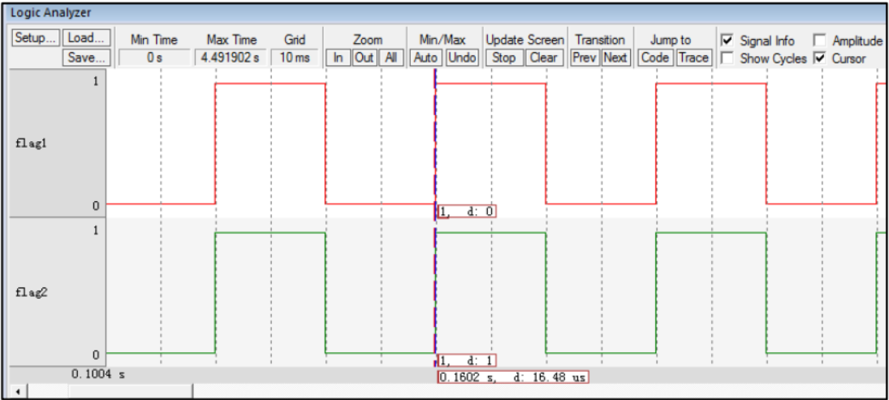
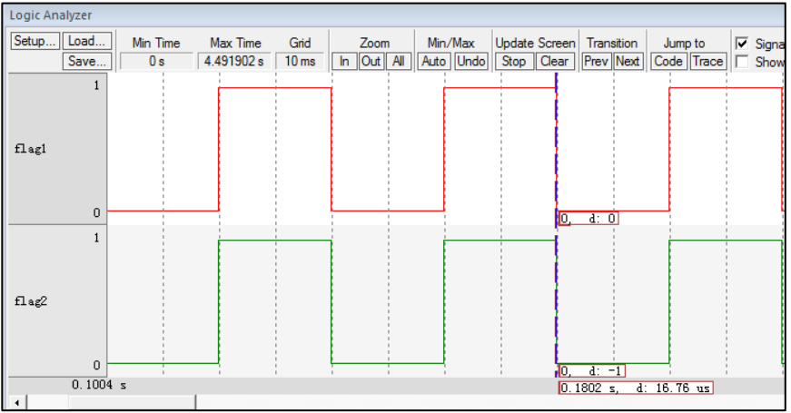

### 空闲任务与阻塞延时 

软件延时即是让 CPU 空等来达到延时的效果。使用 RTOS 的很大优势就是榨干 CPU 的性能，永远不能让它闲着， 任务如果需要延时也就不能再让 CPU 空等来实现延时的效果。 RTOS 中的延时叫阻塞延时，即任务需要延时的时候， 任务会放弃 CPU 的使用权， CPU 可以去干其它的事情，当任务延时时间到，重新获取 CPU 使用权， 任务继续运行，这样就充分地利用了 CPU 的资源，而不是干等着。
当任务需要延时，进入阻塞状态，那 CPU 又去干什么事情了？如果没有其它任务可以运行， RTOS 都会为 CPU 创建一个空闲任务，这个时候 CPU 就运行空闲任务。 在FreeRTOS 中，空闲任务是系统在【启动调度器】 的时候创建的优先级最低的任务，空闲任务主体主要是做一些系统内存的清理工作。但是为了简单起见，我们本次实现的空闲任务只是对一个全局变量进行计数。 鉴于空闲任务的这种特性，在实际应用中，当系统进入空闲任务的时候， 可在空闲任务中让单片机进入休眠或者低功耗等操作。 

#### 1、实现空闲任务 

目前我们在创建任务时使用的栈和 TCB 都使用的是静态的内存，即需要预先定义好内存，空闲任务也不例外。有关空闲任务的栈和 TCB 需要用到的内存空间均在 main.c 中定义。 

##### 1.1 、定义空闲任务栈

```c++
/* 定义空闲任务的栈 */
#define configMINIMAL_STACK_SIZE ( ( unsigned short ) 128 )
StackType_t IdleTaskStack[configMINIMAL_STACK_SIZE];
```

空闲任务的栈是一个定义好的数组，大小由 `FreeRTOSConfig.h`中定义的宏 `configMINIMAL_STACK_SIZE` 控制，默认为 128， 单位为字，即 512 个字节。 

##### 1.2、定义空闲任务的任务控制块 

任务控制块是每一个任务必须的，空闲任务的的任务控制块我们在 main.c 中定义，是
一个全局变量 。

```c++
/* 定义空闲任务的任务控制块 */
TCB_t IdleTaskTCB;
```

##### 1.3、创建空闲任务

空闲任务在调度器启动函数` vTaskStartScheduler()`中创建。

```c++
extern TCB_t IdleTaskTCB;
void vApplicationGetIdleTaskMemory( 	TCB_t **ppxIdleTaskTCBBuffer,
					StackType_t **ppxIdleTaskStackBuffer,
					uint32_t *pulIdleTaskStackSize );
void vTaskStartScheduler( void )
{
/*=======================创建空闲任务 start=======================*/
    TCB_t *pxIdleTaskTCBBuffer = NULL; /* 用于指向空闲任务控制块 */
    StackType_t *pxIdleTaskStackBuffer = NULL; /* 用于空闲任务栈起始地址 */
    uint32_t ulIdleTaskStackSize;

    /* 获取空闲任务的内存：任务栈和任务 TCB */
    vApplicationGetIdleTaskMemory( 	&pxIdleTaskTCBBuffer,
                                    	&pxIdleTaskStackBuffer,
                                    	&ulIdleTaskStackSize );
    /* 创建空闲任务 */
    xIdleTaskHandle =
    xTaskCreateStatic( 	(TaskFunction_t)prvIdleTask, /* 任务入口 */
                        (char *)"IDLE", /* 任务名称，字符串形式 */
                        (uint32_t)ulIdleTaskStackSize , /* 任务栈大小，单位为字 */
                        (void *) NULL, /* 任务形参 */
                        (StackType_t *)pxIdleTaskStackBuffer, /* 任务栈起始地址 */
                        (TCB_t *)pxIdleTaskTCBBuffer ); /* 任务控制块 */
    /* 将任务添加到就绪列表 */
    vListInsertEnd( &( pxReadyTasksLists[0] ),
                    &( ((TCB_t *)pxIdleTaskTCBBuffer)->xStateListItem ) );
    /*==========================创建空闲任务 end=====================*/

    /* 手动指定第一个运行的任务 */
    pxCurrentTCB = &Task1TCB;
    /* 启动调度器 */
    if ( xPortStartScheduler() != pdFALSE )
    {
        /* 调度器启动成功，则不会返回，即不会来到这里 */
    }
}
```

- 获 取 空 闲 任 务 的 内 存 ， 即 将`pxIdleTaskTCBBuffer`和`pxIdleTaskStackBuffer `这两个接下来要作为形参传到 `xTaskCreateStatic()`函数的指针分别指向空闲任务的 TCB 和栈的起始地址，这个操作由函数`vApplicationGetIdleTaskMemory()`来实现，该函数需要用户自定义，目前我们在 main.c 中实现

- 调用 xTaskCreateStatic()函数创建空闲任务。
- 将空闲任务插入到就绪列表的开头。 在下一章我们会支持优先级，空闲任务默认的优先级是最低的，即排在就绪列表的开头。 

**vApplicationGetIdleTaskMemory()函数** 

```c++
void vApplicationGetIdleTaskMemory( TCB_t **ppxIdleTaskTCBBuffer,
									StackType_t **ppxIdleTaskStackBuffer,
									uint32_t *pulIdleTaskStackSize )
{
	*ppxIdleTaskTCBBuffer=&IdleTaskTCB;
	*ppxIdleTaskStackBuffer=IdleTaskStack;
	*pulIdleTaskStackSize=configMINIMAL_STACK_SIZE;
}
```

#### 2、实现阻塞延时 

##### 1.1、vTaskDelay ()函数 

阻塞延时的阻塞是指任务调用该延时函数后， 任务会被剥离 CPU 使用权，然后进入阻塞状态，直到延时结束， 任务重新获取 CPU 使用权才可以继续运行。在任务阻塞的这段时间， CPU 可以去执行其它的任务，如果其它的任务也在延时状态，那么 CPU 就将运行空闲任务。 

**vTaskDelay()函数** 

```c++
void vTaskDelay( const TickType_t xTicksToDelay )
{
	TCB_t *pxTCB = NULL;

	/* 获取当前任务的 TCB */
	pxTCB = pxCurrentTCB;

	/* 设置延时时间 */
	pxTCB->xTicksToDelay = xTicksToDelay;

 	/* 任务切换 */
 	taskYIELD(); 
 }
```

- 获取当前任务的任务控制块。 pxCurrentTCB 是一个在 task.c 定义的
  全局指针，用于指向当前正在运行或者即将要运行的任务的任务控制块。 

- xTicksToDelay 是任务控制块的一个成员，用于记录任务需要延时
  的时间，单位为 SysTick 的中断周期。比如我们本书当中 SysTick 的中断周期为 10ms，调
  用 vTaskDelay( 2 )则完成 2*10ms 的延时。  

**xTicksToDelay 定义**

```c++
typedef struct tskTaskControlBlock
{
    volatile StackType_t *pxTopOfStack; 	/* 栈顶 */

    ListItem_t xStateListItem; 				/* 任务节点 */

    StackType_t *pxStack; 					/* 任务栈起始地址 */
    
    /* 任务名称，字符串形式 */
    char pcTaskName[ configMAX_TASK_NAME_LEN ];

    TickType_t xTicksToDelay; 				/* 用于延时 */
} tskTCB;
```

##### 1.2、修改 vTaskSwitchContext()函数 

任务切换。 调用` tashYIELD()`会产生` PendSV` 中断，在` PendSV` 中断服务函数中会调用上下文切换函数 `vTaskSwitchContext()`，该函数的作用是寻找最高优先级的就绪任务，然后更新` pxCurrentTCB`。 上一章我们只有两个任务， 则 `pxCurrentTCB` 不是指向任务 1 就是指向任务 2，本章节开始我们多增加了一个空闲任务，则需要让`pxCurrentTCB` 在这三个任务中切换， 算法需要改变 。

**vTaskSwitchContext()函数** 

```c++
#if 0
void vTaskSwitchContext( void )
{ /* 两个任务轮流切换 */
    if ( pxCurrentTCB == &Task1TCB ) {
    	pxCurrentTCB = &Task2TCB;
    } else {
    	pxCurrentTCB = &Task1TCB;
    }
}
#else
void vTaskSwitchContext( void )
{
    /* 如果当前任务是空闲任务，那么就去尝试执行任务 1 或者任务 2，
    看看他们的延时时间是否结束，如果任务的延时时间均没有到期，
    那就返回继续执行空闲任务 */
    if ( pxCurrentTCB == &IdleTaskTCB ) {
    	if (Task1TCB.xTicksToDelay == 0) {
            pxCurrentTCB =&Task1TCB;
        } else if (Task2TCB.xTicksToDelay == 0) {
        	pxCurrentTCB =&Task2TCB;
    	} else {
    		return; /* 任务延时均没有到期则返回，继续执行空闲任务 */
    	}
    } else /* 当前任务不是空闲任务则会执行到这里 */ {
    /*如果当前任务是任务 1 或者任务 2 的话，检查下另外一个任务,
    如果另外的任务不在延时中，就切换到该任务
    否则，判断下当前任务是否应该进入延时状态，
    如果是的话，就切换到空闲任务。否则就不进行任何切换 */
        if (pxCurrentTCB == &Task1TCB) {
        	if (Task2TCB.xTicksToDelay == 0) {
        		pxCurrentTCB =&Task2TCB;
        	} else if (pxCurrentTCB->xTicksToDelay != 0) {
        		pxCurrentTCB = &IdleTaskTCB;
        	} else {
        		return; /* 返回，不进行切换，因为两个任务都处于延时中 */
        	}
        } else if (pxCurrentTCB == &Task2TCB) {
        	if (Task1TCB.xTicksToDelay == 0) {
        		pxCurrentTCB =&Task1TCB;
        	} else if (pxCurrentTCB->xTicksToDelay != 0) {
        		pxCurrentTCB = &IdleTaskTCB;
        	} else {
        		return; /* 返回，不进行切换，因为两个任务都处于延时中 */
        	}
    	}
    }
}
#endif
```

- 如果当前任务是空闲任务，那么就去尝试执行任务 1 或者任务 2，
  看看他们的延时时间是否结束，如果任务的延时时间均没有到期，那就返回继续执行空闲
  任务。 
- 如果当前任务是任务 1 或者任务 2 的话，检查下另外一个任务， 如
  果另外的任务不在延时中，就切换到该任务。 否则，判断下当前任务是否应该进入延时状
  态，如果是的话，就切换到空闲任务， 否则就不进行任何切换 。 

#### 3、SysTick 中断服务函数 

在任务上下文切换函数` vTaskSwitchContext ()`中，会判断每个任务的任务控制块中的延时成员 `xTicksToDelay` 的值是否为 0，如果为 0 就要将对应的任务就绪， 如果不为 0 就继续延时。如果一个任务要延时，一开始 `xTicksToDelay `肯定不为 0，当` xTicksToDelay` 变为0 的时候表示延时结束 。<font size=2>（SysTick 中断服务函数在 port.c.c 中实现 ）</font>

```c++
void xPortSysTickHandler( void )
{
    /* 进入临界段，关中断 */
    /* 关中断 */
    vPortRaiseBASEPRI();

    /* 更新系统时基 */
    xTaskIncrementTick();

    /* 开中断 */
    vPortClearBASEPRIFromISR();
}
```

##### 3.1、xTaskIncrementTick()函数 

```c++
void xTaskIncrementTick( void )
{
    TCB_t *pxTCB = NULL;
    BaseType_t i = 0;

    /* 更新系统时基计数器 xTickCount， xTickCount 是一个在 port.c 中定义的全局变量 */
    const TickType_t xConstTickCount = xTickCount + 1;
    xTickCount = xConstTickCount;

    /* 扫描就绪列表中所有任务的 xTicksToDelay，如果不为 0，则减 1 */
    for (i = 0; i < configMAX_PRIORITIES; i++) {
        pxTCB = ( TCB_t * ) listGET_OWNER_OF_HEAD_ENTRY( ( &pxReadyTasksLists[i] ) );
        if (pxTCB->xTicksToDelay > 0) {
        	pxTCB->xTicksToDelay--;
        }
    }

    /* 任务切换 */
    portYIELD();
}
```

- 更新系统时基计数器 xTickCount， 加一操作。 xTickCount 是一个在
  port.c 中定义的全局变量， 在函数 vTaskStartScheduler()中调用 xPortStartScheduler()函数前
  初始化。 
- 扫描就绪列表中所有任务的 xTicksToDelay，如果不为 0，则减 1。 
- 执行一次任务切换。 
- 退出临界段，开中断。 

#### 4、SysTick 初始化函数 

**vPortSetupTimerInterrupt()函数** 

```c++
/* SysTick 控制寄存器 */ 
#define portNVIC_SYSTICK_CTRL_REG (*((volatile uint32_t *) 0xe000e010 ))
/* SysTick 重装载寄存器寄存器 */
#define portNVIC_SYSTICK_LOAD_REG (*((volatile uint32_t *) 0xe000e014 ))

/* SysTick 时钟源选择 */
#ifndef configSYSTICK_CLOCK_HZ
#define configSYSTICK_CLOCK_HZ configCPU_CLOCK_HZ
/* 确保 SysTick 的时钟与内核时钟一致 */
#define portNVIC_SYSTICK_CLK_BIT ( 1UL << 2UL )
#else
#define portNVIC_SYSTICK_CLK_BIT ( 0 )
#endif

#define portNVIC_SYSTICK_INT_BIT ( 1UL << 1UL )
#define portNVIC_SYSTICK_ENABLE_BIT ( 1UL << 0UL )


void vPortSetupTimerInterrupt( void ) 
{
    /*  设置重装载寄存器的值 */ 
	portNVIC_SYSTICK_LOAD_REG = ( configSYSTICK_CLOCK_HZ / configTICK_RATE_HZ ) - 	1UL;

    /* 	设置系统定时器的时钟等于内核时钟
        使能 SysTick 定时器中断
        使能 SysTick 定时器 */
    portNVIC_SYSTICK_CTRL_REG = ( portNVIC_SYSTICK_CLK_BIT |
                                 portNVIC_SYSTICK_INT_BIT |
                                 portNVIC_SYSTICK_ENABLE_BIT );
}
```

- 配置 SysTick 需要用到的寄存器和宏定义，在 port.c 中实现。 
- SysTick 初 始 化 函 数 vPortSetupTimerInterrupt() ， 在
  xPortStartScheduler()中被调用 。
- 设置重装载寄存器的值， 决定 `SysTick `的中断周期。 如 果 没 有 定 义 `configSYSTICK_CLOCK_HZ` 那 么
  `configSYSTICK_CLOCK_HZ` 就 等 于 `configCPU_CLOCK_HZ` ，`configSYSTICK_CLOCK_HZ` 确 实 没 有 定 义 ， 则 `configSYSTICK_CLOCK_HZ `由 在`FreeRTOSConfig.h `中定义的` configCPU_CLOCK_HZ` 决定， 同时 `configTICK_RATE_HZ` 也在 `FreeRTOSConfig.h `中定义 

**vPortSetupTimerInterrupt()** 

```c++
BaseType_t xPortStartScheduler( void )
{
    /* 配置 PendSV 和 SysTick 的中断优先级为最低 */
    portNVIC_SYSPRI2_REG |= portNVIC_PENDSV_PRI;
    portNVIC_SYSPRI2_REG |= portNVIC_SYSTICK_PRI;

    /* 初始化 SysTick */
    vPortSetupTimerInterrupt();

    /* 启动第一个任务，不再返回 */
    prvStartFirstTask();

    /* 不应该运行到这里 */
    return 0;
}
```

**configCPU_CLOCK_HZ 与 configTICK_RATE_HZ 宏定义** 

```c++
#define configCPU_CLOCK_HZ (( unsigned long ) 25000000) 
#define configTICK_RATE_HZ (( TickType_t ) 100)
```

- 系统时钟的大小，因为目前是软件仿真，需要配置成与`system_ARMCM3.c`(`system_ARMCM4.c` 或 `system_ARMCM7.c`)文件中的` SYSTEM_CLOCK`的一样， 即等于 25M。如果有具体的硬件，则配置成与硬件的系统时钟一样。 
- SysTick 每秒中断多少次，目前配置为 100，即每 10ms 中断一次。 
- 设置系统定时器的时钟等于内核时钟，使能 SysTick 定时器中断，使能 SysTick 定时器。 

#### 5、main函数

```c++
/*
*************************************************************************
* 包含的头文件
*************************************************************************
*/
#include "FreeRTOS.h"
#include "task.h"

/*
 *************************************************************************
 * 全局变量
 *************************************************************************
 */
portCHAR flag1;
portCHAR flag2;

extern List_t pxReadyTasksLists[ configMAX_PRIORITIES ];


/*
 *************************************************************************
 * 任务控制块 & STACK
 *************************************************************************
 */
TaskHandle_t Task1_Handle;
#define TASK1_STACK_SIZE 128
StackType_t Task1Stack[TASK1_STACK_SIZE];
TCB_t Task1TCB;

TaskHandle_t Task2_Handle;
#define TASK2_STACK_SIZE 128
StackType_t Task2Stack[TASK2_STACK_SIZE];
TCB_t Task2TCB;


/*
 *************************************************************************
 * 函数声明
 *************************************************************************
 */
void delay (uint32_t count);
void Task1_Entry( void *p_arg );
void Task2_Entry( void *p_arg );

/*
 ************************************************************************
 * main 函数
 ************************************************************************
 */

int main(void)
{
    /* 硬件初始化 */
    /* 将硬件相关的初始化放在这里，如果是软件仿真则没有相关初始化代码 */

    /* 初始化与任务相关的列表，如就绪列表 */
    prvInitialiseTaskLists();

    /* 创建任务 */
    Task1_Handle =
        xTaskCreateStatic( (TaskFunction_t)Task1_Entry, /* 任务入口 */
                          (char *)"Task1", /* 任务名称，字符串形式 */
                          (uint32_t)TASK1_STACK_SIZE , /* 任务栈大小，单位为字 */
                          (void *) NULL, /* 任务形参 */
                          (StackType_t *)Task1Stack, /* 任务栈起始地址 */
                          (TCB_t *)&Task1TCB ); /* 任务控制块 */
    /* 将任务添加到就绪列表 */
    vListInsertEnd( &( pxReadyTasksLists[1] ),
                   &( ((TCB_t *)(&Task1TCB))->xStateListItem ) );

    Task2_Handle =
        xTaskCreateStatic( (TaskFunction_t)Task2_Entry, /* 任务入口 */
                          (char *)"Task2", /* 任务名称，字符串形式 */
                          (uint32_t)TASK2_STACK_SIZE , /* 任务栈大小，单位为字 */
                          (void *) NULL, /* 任务形参 */
                          (StackType_t *)Task2Stack, /* 任务栈起始地址 */
                          (TCB_t *)&Task2TCB ); /* 任务控制块 */
    /* 将任务添加到就绪列表 */
    vListInsertEnd( &( pxReadyTasksLists[2] ),
                   &( ((TCB_t *)(&Task2TCB))->xStateListItem ) );

    /* 启动调度器，开始多任务调度，启动成功则不返回 */
    vTaskStartScheduler();

    for (;;)
    {
        /* 系统启动成功不会到达这里 */
    }
}

/*
 *************************************************************************
 * 函数实现
 *************************************************************************
 */
/* 软件延时 */
void delay (uint32_t count)
{
    for (; count!=0; count--);
}
/* 任务 1 */
void Task1_Entry( void *p_arg )
{
    for ( ;; )
    {
        #if 0
        flag1 = 1;
        delay( 100 );
        flag1 = 0;
        delay( 100 );

        /* 任务切换，这里是手动切换 */
        portYIELD();
        #else
        flag1 = 1;
        vTaskDelay( 2 );
        flag1 = 0;
        vTaskDelay( 2 );
        #endif
    }
}

/* 任务 2 */
void Task2_Entry( void *p_arg )
{
    for ( ;; )
    {
        #if 0
        flag2 = 1;
        delay( 100 );
        flag2 = 0;
        delay( 100 );

        /* 任务切换，这里是手动切换 */
        portYIELD();
        #else
        flag2 = 1;
        vTaskDelay( 2 );
        flag2 = 0;
        vTaskDelay( 2 );
        #endif
    }
}

/* 获取空闲任务的内存 */
StackType_t IdleTaskStack[configMINIMAL_STACK_SIZE];
TCB_t IdleTaskTCB;
void vApplicationGetIdleTaskMemory( TCB_t **ppxIdleTaskTCBBuffer,
                                   StackType_t **ppxIdleTaskStackBuffer,
                                   uint32_t *pulIdleTaskStackSize )
{
    *ppxIdleTaskTCBBuffer=&IdleTaskTCB;
    *ppxIdleTaskStackBuffer=IdleTaskStack;
    *pulIdleTaskStackSize=configMINIMAL_STACK_SIZE;
}
```

延时函数均由原来的软件延时替代为阻塞延时，延时时间均为 2 个 SysTick 中断周期，即 20ms。 

##### 6、现象






