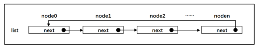
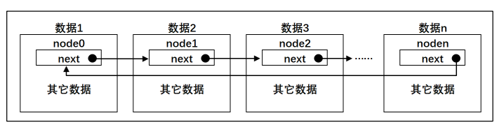
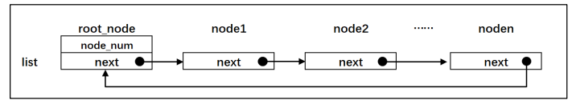
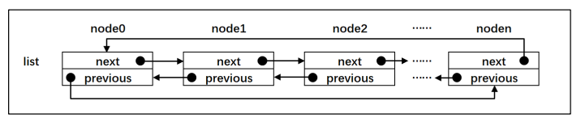

在 FreeRTOS 中存在大量的基础数据结构列表和列表项操作，其实就是对应我们 C 语言中的链表和节点。

### 单向链表

定义：前一个结点都有一个箭头指向后一个节点，首尾相连，组成一个圈。


#### 1、节点结构体

1、自定义节点数据结构，包含数据、数组、指针数据和自定义结构体数据类型。

```C
struct node
{	
	struct node *next;       /* 指向链表下一个节点 */
    char   data1;			 /* 单个数据 */
	unsigned char array[];   /* 数组 */	
	unsigned long *prt;		 /* 指针数组 */
	stuct userstruct data2;	 /* 自定义结构体类型数据 */
};
```

2、内嵌的节点挂接到链表

```c
struct node
{	
	struct node *next;       /* 指向链表下一个节点 */
};

stuct userstruct	 		
{
	 /* 在结构体中，内嵌一个节点指针，通过这个节点将数据挂接到链表 */
	struct node *next; 
    /* ...... 要存储的数据类型 */
};
```



#### 2、链表操作

链表最大作用就是通过节点把离散的数据链接在一起组成一个表。可以通过节点的插入和删除修改链表，通常会有一个根节点，称这个根节点为生产者。还会有一个节点计数器，由于统计整条链表的节点个数。



#### 3、双向链表

每个节点中包含两个结点指针，分别指向前后两个节点。



##### 链表和数组

链表是通过节点把离散的数据链接成一个表，通过对节点的插入和删除从而实现对数据的存取。

数组是通过开辟一段连续的内存来存储数据。

#### 4、FreeRTOS 链表节点结构体

##### 1、链表结构体

```c
/* 节点结构体定义 */
struct xLIST_ITEM
{
	TickType_t xItemValue;             /* ¸辅助值，用于帮助节点做顺序排列 */			
	struct xLIST_ITEM *  pxNext;       /* 指向链表下一个节点 */		
	struct xLIST_ITEM *  pxPrevious;   /* 指向链表前一个节点 */	
	void * pvOwner;					   /* 指向拥有该节点的内核对象，通常是 TCB */
	void *  pvContainer;		       /* 指向该节点所在的链表 */
};
typedef struct xLIST_ITEM ListItem_t;  /* 节点数据类型重定义 */
```

辅助值：用于帮助节点做顺序排列。<font size=2>（注：数据类型在 portmacro.h 文件中）</font>

TickType_t 具体表示 16 位还是 32 位，由 configUSE_16_BIT_TICKS 这个宏决定，宏定义为 1 时，TickType_t  为 16 位，否则为 32 为位。<font size=2>(宏定义在 FreeRTOSConfig.h 中)</font>

##### 2、链表节点初始化

```c
/* 节点初始化 */
void vListInitialiseItem( ListItem_t * const pxItem )
{
	/* 初始化该节点所在的链表为空，表示节点还没有插入任何链表 */
	pxItem->pvContainer = NULL;
}
```

##### 3、链表根节点数据结构

```c
/* 链表根节点结构体 */
typedef struct xLIST
{
	UBaseType_t uxNumberOfItems;    /* 链表节点计数器 */
	ListItem_t *  pxIndex;			/* 链表节点索引指针 */
	MiniListItem_t xListEnd;		/* 链表最后一个节点 */
} List_t;
```

链表节点计数器：用于表示该链表有多少个节点，根节点除外。

链表节点索引指针：用于遍历节点。

链表最后一个节点：链表是首尾相连的，首就是尾，尾就是首。

```c
/* mini 结构体定义，作为双向链表的结尾
   链表是首尾相连的，首就是尾，尾就是首 */
struct xMINI_LIST_ITEM
{
	TickType_t xItemValue;                      /* 辅助值，用于帮助节点做升序排列 */
	struct xLIST_ITEM *  pxNext;                /* 指向链表下一个节点 */
	struct xLIST_ITEM *  pxPrevious;            /* 指向链表前一个节点 */
};
typedef struct xMINI_LIST_ITEM MiniListItem_t;  /* 精简节点数据类型重定义 */
```

#### 4、链表根节点初始化

```c
void vListInitialise( List_t * const pxList )
{
	/* 将链表索引指针指向最后一个节点 */
	pxList->pxIndex = ( ListItem_t * ) &( pxList->xListEnd );

	/* 将链表最后一个节点的辅助排序的值设置为最大，确保该节点就是链表的最后节点 */
	pxList->xListEnd.xItemValue = portMAX_DELAY;

	/* 将最后一个节点的 pxNext 和 pxPrevious 指针均指向节点自身，表示链表为空 */
	pxList->xListEnd.pxNext = ( ListItem_t * ) &( pxList->xListEnd );
	pxList->xListEnd.pxPrevious = ( ListItem_t * ) &( pxList->xListEnd );

	/* 初始化链表节点计数器的值为 0，表示链表为空 */
	pxList->uxNumberOfItems = ( UBaseType_t ) 0U;
}
```

将链表索引指针指向最后一个节点， 即第一个节点， 或者第零个节点更准确，因为这个节点不会算入节点计数器的值 。

将链表最后（也可以理解为第一） 一个节点的辅助排序的值设置为最大，确保该节点就是链表的最后节点（也可以理解为第一）。 

将最后一个节点（也可以理解为第一） 的 pxNext 和 pxPrevious 指针均指向节点自身，表示链表为空 。

初始化链表节点计数器的值为 0，表示链表为空 。
