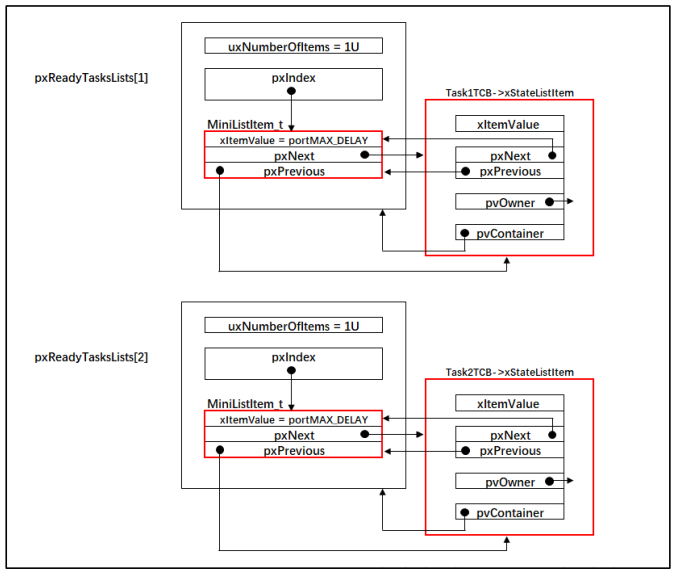
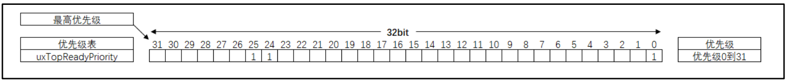

### 多优先级

在 FreeRTOS 中，数字优先级越小，逻辑优先级也越小，这与隔壁的 RT-Thread 和 μC/OS 刚好相反。 

就绪列表` pxReadyTasksLists[ configMAX_PRIORITIES ]`是一个数组， 数组里面存的是就绪任务的 `TCB`（准确来说是 `TCB` 里面的 `xStateListItem` 节点） ，数组的下标对应任务的优先级，优先级越低对应的数组下标越小。空闲任务的优先级最低，对应的是下标为 0 的链表。  



- 任务在创建的时候，会根据任务的优先级将任务插入到就绪列表不同的位置。相同优
  先级的任务插入到就绪列表里面的同一条链表中 。
- pxCurrenTCB 是一个全局的 TCB 指针，用于指向优先级最高的就绪任务的 TCB，即当前正在运行的 TCB。那么我们要想让任务支持优先级，即只要解决在任务切换（taskYIELD） 的时候，让 pxCurrenTCB 指向最高优先级的就绪任务的 TCB 就可以 。

**查找最高优先级的就绪任务的相关代码** 

```c++
/* 查找最高优先级的就绪任务：通用方法 */
#if ( configUSE_PORT_OPTIMISED_TASK_SELECTION == 0 )
/* uxTopReadyPriority 存的是就绪任务的最高优先级 */
#define taskRECORD_READY_PRIORITY( uxPriority )\ 
{\
    if( ( uxPriority ) > uxTopReadyPriority )\
    {\
        uxTopReadyPriority = ( uxPriority );\
    }\
} /* taskRECORD_READY_PRIORITY */

/*-----------------------------------------------------------*/

#define taskSELECT_HIGHEST_PRIORITY_TASK()\ 
{\
    UBaseType_t uxTopPriority = uxTopReadyPriority;\ 
        /* 寻找包含就绪任务的最高优先级的队列 */\ 
        while( listLIST_IS_EMPTY( &( pxReadyTasksLists[ uxTopPriority ] ) ) )\
        {\
            --uxTopPriority;\
        }\
            /* 获取优先级最高的就绪任务的 TCB，然后更新到 pxCurrentTCB */\
            listGET_OWNER_OF_NEXT_ENTRY(pxCurrentTCB, &(pxReadyTasksLists[ uxTopPriority ]));\ 
            /* 更新 uxTopReadyPriority */\
            uxTopReadyPriority = uxTopPriority;\ 
} /* taskSELECT_HIGHEST_PRIORITY_TASK */

/*-----------------------------------------------------------*/

/* 这两个宏定义只有在选择优化方法时才用，这里定义为空 */
#define taskRESET_READY_PRIORITY( uxPriority )
#define portRESET_READY_PRIORITY( uxPriority, uxTopReadyPriority )

/* 查找最高优先级的就绪任务：根据处理器架构优化后的方法 */
#else /* configUSE_PORT_OPTIMISED_TASK_SELECTION */

#define taskRECORD_READY_PRIORITY( uxPriority ) \
portRECORD_READY_PRIORITY( uxPriority, uxTopReadyPriority )

    /*-----------------------------------------------------------*/

    #define taskSELECT_HIGHEST_PRIORITY_TASK()\
{\
    UBaseType_t uxTopPriority;\
        /* 寻找最高优先级 */\
        portGET_HIGHEST_PRIORITY( uxTopPriority, uxTopReadyPriority );\ 
        /* 获取优先级最高的就绪任务的 TCB，然后更新到 pxCurrentTCB */\
        listGET_OWNER_OF_NEXT_ENTRY( pxCurrentTCB, &( pxReadyTasksLists[ uxTopPriority ] ) );\ 
} /* taskSELECT_HIGHEST_PRIORITY_TASK() */

/*-----------------------------------------------------------*/
#if 0
#define taskRESET_READY_PRIORITY( uxPriority )\ 
{\
    if(listCURRENT_LIST_LENGTH(&(pxReadyTasksLists[( uxPriority)]))==(UBaseType_t)0)\
    {\
        portRESET_READY_PRIORITY( ( uxPriority ), ( uxTopReadyPriority ) );\
    }\
}
#else
#define taskRESET_READY_PRIORITY( uxPriority )\ 
{\
    portRESET_READY_PRIORITY((uxPriority ), (uxTopReadyPriority));\
}
#endif

#endif /* configUSE_PORT_OPTIMISED_TASK_SELECTION */
```

- 查 找 最 高 优 先 级 的 就 绪 任 务 有 两 种 方 法 ， 具 体 由
  `configUSE_PORT_OPTIMISED_TASK_SELECTION` 这个宏控制， 定义为 0 选择通用方法，定义为 1 选择根据处理器优化的方法，该宏默认在 `portmacro.h` 中定义为 1 。

#### 1、通用方法 

**taskRECORD_READY_PRIORITY()** 

`taskRECORD_READY_PRIORITY()`用于更新 `uxTopReadyPriority`的值。 `uxTopReadyPriority` 是一个在 `task.c` 中定义的静态变量， 用于表示创建的任务的最高优先级， 默认初始化为 0，即空闲任务的优先级 

```c++
/* 空闲任务优先级宏定义，在 task.h 中定义 */
#define tskIDLE_PRIORITY ( ( UBaseType_t ) 0U )

/* 定义 uxTopReadyPriority，在 task.c 中定义 */
static volatile UBaseType_t uxTopReadyPriority = tskIDLE_PRIORITY;
```

**taskSELECT_HIGHEST_PRIORITY_TASK()** 

- `taskSELECT_HIGHEST_PRIORITY_TASK()`用于寻找优先级最高的就绪任务， 实质就是更新 `uxTopReadyPriority `和 `pxCurrentTCB `的值。 

- 将 `uxTopReadyPriority` 的值暂存到局部变量 `uxTopPriority `

- 从最高优先级对应的就绪列表数组下标开始寻找当前链表下是否有任务存在，如果没有，则 `uxTopPriority` 减一操作，继续寻找下一个优先级对应的链表中是否有任务存在， 如果有则跳出 while 循环，表示找到了最高优先级的就绪任务。  

- 获取优先级最高的就绪任务的 TCB，然后更新到 `pxCurrentTCB`。 
- 更新 `uxTopPriority` 的值到 `uxTopReadyPriority`。 

#### 2、优化方法 

Cortex-M 内核有一个计算前导零的指令CLZ，所谓前导零就是计算一个变量（Cortex-M 内核单片机的变量为 32 位）从高位开始第一次出现 1 的位的前面的零的个数。 

 

如果 uxTopReadyPriority 的每个位号对应的是任务的优先级，任务就绪时，则将对应的位置 1，反之则清零。 

利用前导零计算指令可以很快计算出就绪任务中的最高优先级为： 

( 31UL - ( uint32_t ) __clz( ( uxReadyPriorities ) ) ) 

**taskRECORD_READY_PRIORITY()** 

`taskRECORD_READY_PRIORITY()`用于根据传进来的形参（通常形参就是任务的优先级） 将变量 `uxTopReadyPriority` 的某个位置 1。 `uxTopReadyPriority `是一个在 `task.c` 中定义的静态变量，默认初始化为 0。与通用方法中用来表示创建的任务的最高优先级不一样，它在优化方法中担任的是一个优先级位图表的角色，即该变量的每个位对应任务的优先级，如果任务就绪，则将对应的位置 1，反之清零。 

**taskRECORD_READY_PRIORITY()taskRESET_READY_PRIORITY()（portmacro.h 中定义）** 

```c++
#define portRECORD_READY_PRIORITY( uxPriority, uxReadyPriorities )\
    ( uxReadyPriorities ) |= ( 1UL << ( uxPriority ) )

#define portRESET_READY_PRIORITY( uxPriority, uxReadyPriorities )\
    ( uxReadyPriorities ) &= ~( 1UL << ( uxPriority ) )
```

**taskRESET_READY_PRIORITY()** 

- `taskRESET_READY_PRIORITY()`用于根据传进来的形参（通常形参就是任务的优先级） 将变量 `uxTopReadyPriority` 的某个位清零。 

- 所以任务非就绪时暂时不能将任务从就绪列表移除，而是仅仅通过将任务优先级
  在变量 uxTopReadyPriority 中对应的位清零。  实际上根据优先级调用` taskRESET_READY_PRIORITY()`函数复位` uxTopReadyPriority` 变量中对应的位时， 要先确保就绪列表中对应该优先级下的链表没有任务才行。 但是我们当前实现的阻塞延时方案还是通过扫描就绪列表里面的 TCB 的延时 实际上根据优先级调用 taskRESET_READY_PRIORITY()函数复位 `uxTopReadyPriority `变量中对应的位时， 要先确保就绪列表中对应该优先级下的链表没有任务才行。 但是我们当前实现的阻塞延时方案还是通过扫描就绪列表里面的 TCB 的延时 ,所以任务非就绪时暂时不能将任务从就绪列表移除，而是仅仅通过将任务优先级在变量 `uxTopReadyPriority `中对应的位清零。 

**taskSELECT_HIGHEST_PRIORITY_TASK()** 

- `taskSELECT_HIGHEST_PRIORITY_TASK()`用于寻找优先级最高的就绪任务， 实质就是更新 `uxTopReadyPriority` 和` pxCurrentTCB `的值。 

- 根据 `uxTopReadyPriority` 的值， 找到最高优先级， 然后更新到`uxTopPriority `这个局部变量中。  

**portGET_HIGHEST_PRIORITY() 宏定义** 

```c++
#define portGET_HIGHEST_PRIORITY( uxTopPriority, uxReadyPriorities )\
	uxTopPriority = ( 31UL - ( uint32_t ) __clz( ( uxReadyPriorities ) ) )
```

- 根据` uxTopPriority `的值， 从就绪列表中找到就绪的最高优先级的任务的 TCB，然后将 TCB 更新到 `pxCurrentTCB`。 

#### 3、修改代码，支持多优先级 

##### 3.1、修改任务控制块 

```
typedef struct tskTaskControlBlock
{
    volatile StackType_t *pxTopOfStack; /* 栈顶 */

    ListItem_t xStateListItem; /* 任务节点 */

    StackType_t *pxStack; /* 任务栈起始地址 */
    /* 任务名称，字符串形式 */
    char pcTaskName[ configMAX_TASK_NAME_LEN ];

    TickType_t xTicksToDelay;
    UBaseType_t uxPriority;
} tskTCB;
```

##### 3.2、修改 xTaskCreateStatic()函数 

```c++
TaskHandle_t
xTaskCreateStatic(TaskFunction_t pxTaskCode,
                  const char * const pcName,
                  const uint32_t ulStackDepth,
                  void * const pvParameters,
                  /* 任务优先级，数值越大，优先级越高 */
                  UBaseType_t uxPriority, 
                  StackType_t * const puxStackBuffer,
                  TCB_t * const pxTaskBuffer )
{
    TCB_t *pxNewTCB;
    TaskHandle_t xReturn;

    if ( ( pxTaskBuffer != NULL ) && ( puxStackBuffer != NULL ) )
    {
        pxNewTCB = ( TCB_t * ) pxTaskBuffer;
        pxNewTCB->pxStack = ( StackType_t * ) puxStackBuffer;

        /* 创建新的任务 */ 
        prvInitialiseNewTask( pxTaskCode,
                             pcName,
                             ulStackDepth,
                             pvParameters,
                             uxPriority,
                             &xReturn,
                             pxNewTCB);

        /* 将任务添加到就绪列表 */ 
        prvAddNewTaskToReadyList( pxNewTCB );

    }
    else
    {
        xReturn = NULL;
    }

    return xReturn;
}
```

- 增加优先级形参， 数值越大，优先级越高。 

**prvInitialiseNewTask()函数** 

```c++
static void prvInitialiseNewTask(TaskFunction_t pxTaskCode,
                                 const char * const pcName,
                                 const uint32_t ulStackDepth,
                                 void * const pvParameters,
                                 /* 任务优先级，数值越大，优先级越高 */
                                 UBaseType_t uxPriority,
                                 TaskHandle_t * const pxCreatedTask,
                                 TCB_t *pxNewTCB )

{
    StackType_t *pxTopOfStack;
    UBaseType_t x;

    /* 获取栈顶地址 */
    pxTopOfStack = pxNewTCB->pxStack + ( ulStackDepth - ( uint32_t ) 1 );
    /* 向下做 8 字节对齐 */
    pxTopOfStack = ( StackType_t * ) ( ( ( uint32_t ) pxTopOfStack ) & ( ~( ( uint32_t ) 0x0007 ) ) );

    /* 将任务的名字存储在 TCB 中 */
    for ( x = ( UBaseType_t ) 0; x < ( UBaseType_t ) configMAX_TASK_NAME_LEN; x++ )
    {
        pxNewTCB->pcTaskName[ x ] = pcName[ x ];

        if ( pcName[ x ] == 0x00 )
        {
            break;
        }
    }
    /* 任务名字的长度不能超过 configMAX_TASK_NAME_LEN */
    pxNewTCB->pcTaskName[ configMAX_TASK_NAME_LEN - 1 ] = '\0';

    /* 初始化 TCB 中的 xStateListItem 节点 */
    vListInitialiseItem( &( pxNewTCB->xStateListItem ) );
    /* 设置 xStateListItem 节点的拥有者 */
    listSET_LIST_ITEM_OWNER( &( pxNewTCB->xStateListItem ), pxNewTCB );

    /* 初始化优先级 */
    if ( uxPriority >= ( UBaseType_t ) configMAX_PRIORITIES )
    {
        uxPriority = ( UBaseType_t ) configMAX_PRIORITIES - ( UBaseType_t ) 1U;
    }
    pxNewTCB->uxPriority = uxPriority;

    /* 初始化任务栈 */
    pxNewTCB->pxTopOfStack = pxPortInitialiseStack( pxTopOfStack, pxTaskCode, pvParameters );

    /* 让任务句柄指向任务控制块 */
    if ( ( void * ) pxCreatedTask != NULL )
    {
        *pxCreatedTask = ( TaskHandle_t ) pxNewTCB;
    }
}
```

**prvAddNewTaskToReadyList()函数** 

新增将任务添加到就绪列表的函数 `prvAddNewTaskToReadyList()`，该函数在` task.c` 中实现 

```c++
static void prvAddNewTaskToReadyList( TCB_t *pxNewTCB )
{
    /* 进入临界段 */
    taskENTER_CRITICAL();
    {
        /* 全局任务计时器加一操作 */
        uxCurrentNumberOfTasks++; 

        /* 如果 pxCurrentTCB 为空，则将 pxCurrentTCB 指向新创建的任务 */
        if ( pxCurrentTCB == NULL ) 
        {
            pxCurrentTCB = pxNewTCB;

            /* 如果是第一次创建任务，则需要初始化任务相关的列表 */
            if ( uxCurrentNumberOfTasks == ( UBaseType_t ) 1 )
            {
                /* 初始化任务相关的列表 */
                prvInitialiseTaskLists();
            }
        }
        else /* 如果 pxCurrentTCB 不为空，
则根据任务的优先级将 pxCurrentTCB 指向最高优先级任务的 TCB */
        {
            if ( pxCurrentTCB->uxPriority <= pxNewTCB->uxPriority )
            {
                pxCurrentTCB = pxNewTCB;
            }
        }

        /* 将任务添加到就绪列表 */
        prvAddTaskToReadyList( pxNewTCB ); 

    }
    /* 退出临界段 */
    taskEXIT_CRITICAL();
}
```

- 全 局 任 务 计 时 器 `uxCurrentNumberOfTasks` 加 一 操 作 。`uxCurrentNumberOfTasks` 是一个在` task.c` 中定义的静态变量，默认初始化为 0 

- 如果` pxCurrentTCB` 为空，则将 `pxCurrentTCB` 指向新创建的任务。`pxCurrentTCB` 是一个在 task.c 定义的全局指针，用于指向当前正在运行或者即将要运行的任务的任务控制块，默认初始化为 NULL。 

- 如果是第一次创建任务，则需要调用函数 `prvInitialiseTaskLists()`初始化任务相关的列表， 目前只有就绪列表需要初始化，  

**prvInitialiseTaskLists()函数** 

```c++
/* 初始化任务相关的列表 */
void prvInitialiseTaskLists( void )
{
    UBaseType_t uxPriority;

    for ( uxPriority = ( UBaseType_t ) 0U; uxPriority < ( UBaseType_t ) 													configMAX_PRIORITIES; uxPriority++ )
    {
        vListInitialise( &( pxReadyTasksLists[ uxPriority ] ) );
    }
}
```

- 如果 `pxCurrentTCB` 不为空，表示当前已经有任务存在，则根据任务的优先级将 `pxCurrentTCB` 指向最高优先级任务的 `TCB`。在创建任务时，始终让`pxCurrentTCB` 指向最高优先级任务的 `TCB`。 

- 将任务添加到就绪列表。 `prvAddTaskToReadyList()`是一个带参宏，在 task.c 中定义 

**prvAddTaskToReadyList()函数** 

```c++
/* 将任务添加到就绪列表 */
#define prvAddTaskToReadyList( pxTCB )\
taskRECORD_READY_PRIORITY( ( pxTCB )->uxPriority );\
vListInsertEnd( &( pxReadyTasksLists[ ( pxTCB )->uxPriority ] ),\
               &( ( pxTCB )->xStateListItem ) );
```

- 根据优先级将优先级位图表 `uxTopReadyPriority` 中对应的位置位。
- 根据优先级将任务插入到就绪列表 `pxReadyTasksLists[]`。  

##### 3.3、修改 vTaskStartScheduler()函数 

```c++
void vTaskStartScheduler( void )
{
    /*======================创建空闲任务 start==========================*/
    TCB_t *pxIdleTaskTCBBuffer = NULL;
    StackType_t *pxIdleTaskStackBuffer = NULL;
    uint32_t ulIdleTaskStackSize;

    /* 获取空闲任务的内存：任务栈和任务 TCB */
    vApplicationGetIdleTaskMemory( &pxIdleTaskTCBBuffer,
                                  &pxIdleTaskStackBuffer,
                                  &ulIdleTaskStackSize );

    xIdleTaskHandle =
        xTaskCreateStatic( (TaskFunction_t)prvIdleTask,
                          (char *)"IDLE",
                          (uint32_t)ulIdleTaskStackSize ,
                          (void *) NULL,
                          /* 任务优先级，数值越大，优先级越高 */
                          (UBaseType_t) tskIDLE_PRIORITY, 
                          (StackType_t *)pxIdleTaskStackBuffer,
                          (TCB_t *)pxIdleTaskTCBBuffer );
    /* 将任务添加到就绪列表 */ 
    /* vListInsertEnd( &( pxReadyTasksLists[0] ),
&( ((TCB_t *)pxIdleTaskTCBBuffer)->xStateListItem ) ); */
    /*===================创建空闲任务 end=========================*/

    /* 手动指定第一个运行的任务 */ 
    //pxCurrentTCB = &Task1TCB;

    /* 启动调度器 */
    if ( xPortStartScheduler() != pdFALSE )
    {
        /* 调度器启动成功，则不会返回，即不会来到这里 */
    }
}
```

- 创建空闲任务时，优先级配置为 `tskIDLE_PRIORITY`， 该宏在`task.h` 中定义，默认为 0，表示空闲任务的优先级为最低。 

- 刚刚我们已经修改了创建任务函数 `xTaskCreateStatic()`，在创建任务时，就已经将任务添加到了就绪列表， 这里将注释掉 。

- 在刚刚修改的创建任务函数 `xTaskCreateStatic()`中，增加了将任务添加到就绪列表的函数 `prvAddNewTaskToReadyList()`，这里将注释掉。 

##### 3.3、修改 vTaskDelay()函数 

vTaskDelay()函数修改内容是添加了将任务从就绪列表移除的操作 

```c++
void vTaskDelay( const TickType_t xTicksToDelay )
{
    TCB_t *pxTCB = NULL;

    /* 获取当前任务的 TCB */
    pxTCB = pxCurrentTCB;

    /* 设置延时时间 */
    pxTCB->xTicksToDelay = xTicksToDelay;

    /* 将任务从就绪列表移除 */
    //uxListRemove( &( pxTCB->xStateListItem ) ); (注意)
    taskRESET_READY_PRIORITY( pxTCB->uxPriority );

    /* 任务切换 */
    taskYIELD();
}
```

- 将任务从就绪列表移除本应该完成两个操作： 1 个是将任务从就绪列表移除，由函数` uxListRemove()`来实现； 另一个是根据优先级将优先级位图表 `uxTopReadyPriority `中对应的位清零，由函数 `taskRESET_READY_PRIORITY()`来实现。但是鉴于我们目前的时基更新函数 `xTaskIncrementTick `还是需要通过扫描就绪列表的任务来判断任务的延时时间是否到期，所以不能将任务从就绪列表移除。 

##### 3.4、修改 vTaskSwitchContext()函数 

在新的任务切换函数 `vTaskSwitchContext()`中，不再是手动的让 `pxCurrentTCB` 指针在任 务 1 、 任 务 2 和 空 闲 任 务 中 切 换 ， 而 是 直 接 调 用 函 数`taskSELECT_HIGHEST_PRIORITY_TASK()`寻找到优先级最高的就绪任务的` TCB`，然后更新到` pxCurrentTCB` 

```c++
#if 1
/* 任务切换，即寻找优先级最高的就绪任务 */
void vTaskSwitchContext( void )
{
    /* 获取优先级最高的就绪任务的 TCB，然后更新到 pxCurrentTCB */
    taskSELECT_HIGHEST_PRIORITY_TASK();
}
#else
void vTaskSwitchContext( void )
{
    /* 如果当前任务是空闲任务，那么就去尝试执行任务 1 或者任务 2，
看看他们的延时时间是否结束，如果任务的延时时间均没有到期，
那就返回继续执行空闲任务 */
    if ( pxCurrentTCB == &IdleTaskTCB )
    {
        if (Task1TCB.xTicksToDelay == 0)
        {
            pxCurrentTCB =&Task1TCB;
        }
        else if (Task2TCB.xTicksToDelay == 0)
        {
            pxCurrentTCB =&Task2TCB;
        }
        else
        {
            return; /* 任务延时均没有到期则返回，继续执行空闲任务 */
        }
    }
    else
    {
        /*如果当前任务是任务 1 或者任务 2 的话，
检查下另外一个任务,如果另外的任务不在延时中，
就切换到该任务。否则，判断下当前任务是否应该进入延时状态，
如果是的话，就切换到空闲任务。否则就不进行任何切换 */
        if (pxCurrentTCB == &Task1TCB)
        {
            if (Task2TCB.xTicksToDelay == 0)
            {
                pxCurrentTCB =&Task2TCB;
            }
            else if (pxCurrentTCB->xTicksToDelay != 0)
            {
                pxCurrentTCB = &IdleTaskTCB;
            }
            else
            {
                return; /* 返回，不进行切换，因为两个任务都处于延时中 */
            }
        }
        else if (pxCurrentTCB == &Task2TCB)
        {
            if (Task1TCB.xTicksToDelay == 0)
            {
                pxCurrentTCB =&Task1TCB;
            }
            else if (pxCurrentTCB->xTicksToDelay != 0)
            {
                pxCurrentTCB = &IdleTaskTCB;
            }
            else
            {
                return; /* 返回，不进行切换，因为两个任务都处于延时中 */
            }
        }
    }
}

#endif
```

##### 3.5、修改 xTaskIncrementTick()函数 

修改 `xTaskIncrementTick()`函数，即在原来的基础上增加：当任务延时时间到，将任务就绪的代码 

```c++
void xTaskIncrementTick( void )
{
    TCB_t *pxTCB = NULL;
    BaseType_t i = 0;

    const TickType_t xConstTickCount = xTickCount + 1;
    xTickCount = xConstTickCount;


    /* 扫描就绪列表中所有任务的 remaining_tick，如果不为 0，则减 1 */
    for (i=0; i<configMAX_PRIORITIES; i++)
    {
        pxTCB = ( TCB_t * ) listGET_OWNER_OF_HEAD_ENTRY( ( &pxReadyTasksLists[i] ) );
        if (pxTCB->xTicksToDelay > 0)
        {
            pxTCB->xTicksToDelay --;

            /* 延时时间到，将任务就绪 */ 
            if ( pxTCB->xTicksToDelay ==0 )
            {
                taskRECORD_READY_PRIORITY( pxTCB->uxPriority );
            }
        }
    }

    /* 任务切换 */
    portYIELD();
}
```

- 延时时间到，将任务就绪。 即根据优先级将优先级位图表`uxTopReadyPriority` 中对应的位置位。 

#### 4、main 函数 

```c++
/*
*************************************************************************
* 包含的头文件
*************************************************************************
*/
#include "FreeRTOS.h"
#include "task.h"

/*
*************************************************************************
* 全局变量
*************************************************************************
/*
*************************************************************************
* 包含的头文件
*************************************************************************
*/
#include "FreeRTOS.h"
#include "task.h"

/*
*************************************************************************
* 全局变量
*************************************************************************
/* 任务优先级，数值越大，优先级越高 */(3)
(UBaseType_t) 2,
(StackType_t *)Task2Stack,
(TCB_t *)&Task2TCB );
/* 将任务添加到就绪列表 */ (4)
/* vListInsertEnd( &( pxReadyTasksLists[2] ),
&( ((TCB_t *)(&Task2TCB))->xStateListItem ) ); */

/* 启动调度器，开始多任务调度，启动成功则不返回 */
vTaskStartScheduler();

for (;;)
{
    /* 系统启动成功不会到达这里 */
}
}

/*
*************************************************************************
* 函数实现
*************************************************************************
*/
/* 软件延时 */
void delay (uint32_t count)
{
    for (; count!=0; count--);
}
/* 任务 1 */
void Task1_Entry( void *p_arg )
{
    for ( ;; )
    {
        flag1 = 1;
        vTaskDelay( 2 );
        flag1 = 0;
        vTaskDelay( 2 );
    }
}

/* 任务 2 */
void Task2_Entry( void *p_arg )
{
    for ( ;; )
    {
        flag2 = 1;
        vTaskDelay( 2 );
        flag2 = 0;
        vTaskDelay( 2 );
    }
}


/* 获取空闲任务的内存 */
StackType_t IdleTaskStack[configMINIMAL_STACK_SIZE];
TCB_t IdleTaskTCB;
void vApplicationGetIdleTaskMemory( TCB_t **ppxIdleTaskTCBBuffer,
                                   StackType_t **ppxIdleTaskStackBuffer,
                                   uint32_t *pulIdleTaskStackSize )
{
    *ppxIdleTaskTCBBuffer=&IdleTaskTCB;
    *ppxIdleTaskStackBuffer=IdleTaskStack;
    *pulIdleTaskStackSize=configMINIMAL_STACK_SIZE;
}
```

- 设置任务的优先级，数字优先级越高，逻辑优先级越高。 

- 在任务创建函数 `xTaskCreateStatic()`中，已经调用函数 `prvAddNewTaskToReadyList()`将任务插入到了就绪列表。 

