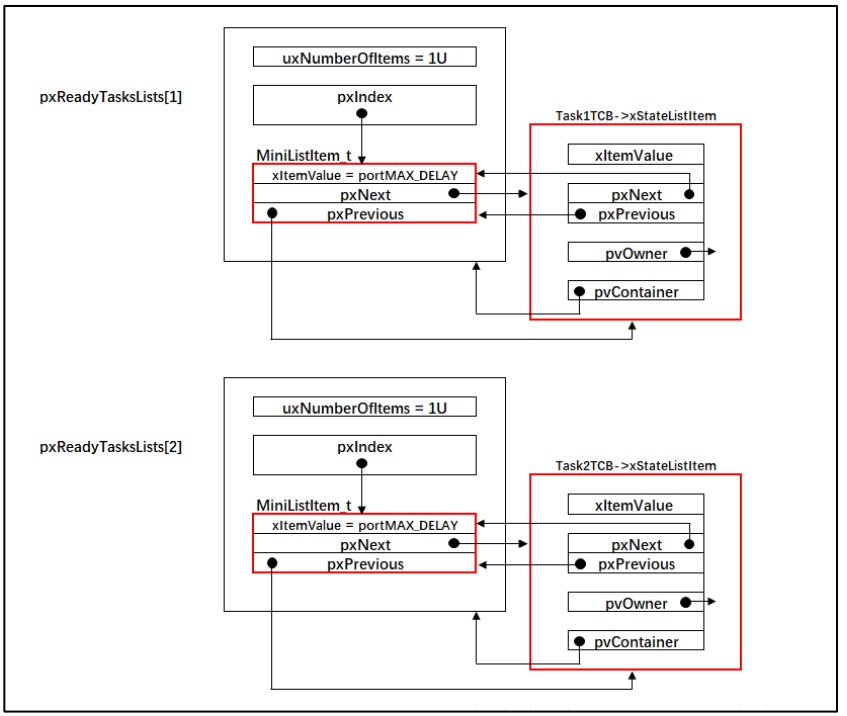
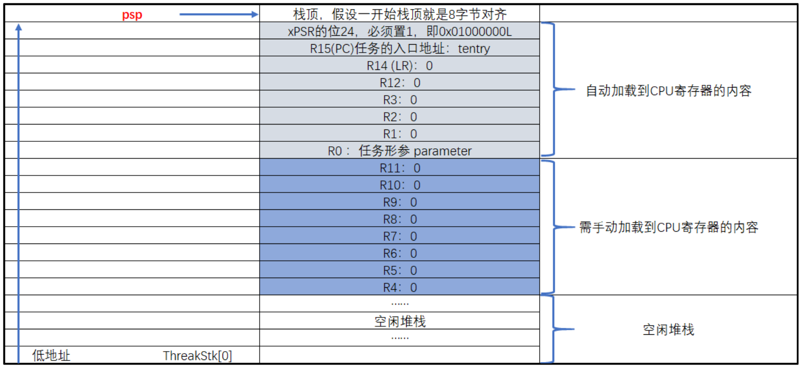
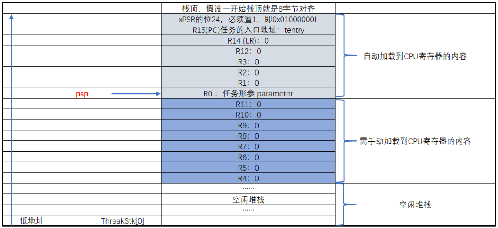
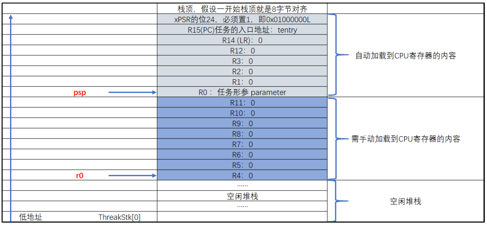
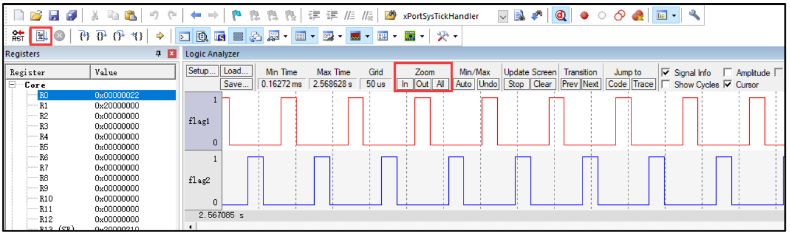
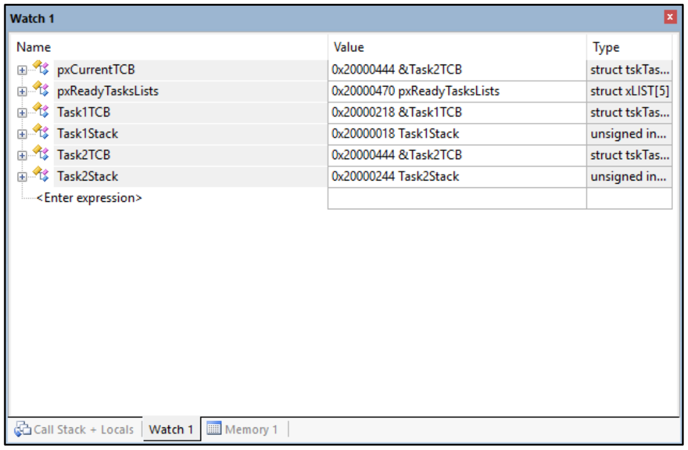

### `任务的定义与任务切换 

裸机系统中两个变量轮流翻转 

```c++
/* flag 必须定义成全局变量才能添加到逻辑分析仪里面观察波形
 * 在逻辑分析仪中要设置以 bit 的模式才能看到波形，不能用默认的模拟量
 */
uint32_t flag1;
uint32_t flag2;


/* 软件延时，不必纠结具体的时间 */
void delay( uint32_t count )
{
    for (; count!=0; count--);
}

int main(void)
{
    /* 无限循环，顺序执行 */
    for (;;) {
        flag1 = 1;
        delay( 100 );
        flag1 = 0;
        delay( 100 );

        flag2 = 1;
        delay( 100 );
        flag2 = 0;
        delay( 100 );
    }
}
```

#### 1、创建任务

##### 1.1、定义任务栈

栈是单片机 RAM 里面一段连续的内存空间，栈的大小一般在启动文件或者链接脚本里面指定， 最后由 C 库函数`_main `进行初始化。 

```c++
#define TASK1_STACK_SIZE 128
StackType_t Task1Stack[TASK1_STACK_SIZE];

#define TASK2_STACK_SIZE 128
StackType_t Task2Stack[TASK2_STACK_SIZE];
```

任务栈其实就是一个预先定义好的全局数据，数据类型为`StackType_t`，大小由 `TASK1_STACK_SIZE` 这个宏来定义， 默认为 128，单位为字，即 512字节，这也是 FreeRTOS 推荐的最小的任务栈。 

**portmacro.h 文件中的数据类型** 

```c++
#ifndef PORTMACRO_H
#define PORTMACRO_H

/* 包含标准库头文件 */
#include "stdint.h"
#include "stddef.h"


/* 数据类型重定义 */
#define portCHAR char
#define portFLOAT float
#define portDOUBLE double
#define portLONG long
#define portSHORT short
#define portSTACK_TYPE uint32_t
#define portBASE_TYPE long

typedef portSTACK_TYPE StackType_t;
typedef long BaseType_t;
typedef unsigned long UBaseType_t;


#endif /* PORTMACRO_H */
```

##### 1.2、定义任务函数

```c++
/* 软件延时 */
void delay (uint32_t count)
{
	for (; count!=0; count--);
}
/* 任务 1 */
void Task1_Entry( void *p_arg ) 
{
    for ( ;; ) {
     flag1 = 1;
     delay( 100 );
     flag1 = 0;
     delay( 100 );
     }
 }

 /* 任务 2 */
 void Task2_Entry( void *p_arg ) 
{
	for ( ;; ) {
        flag2 = 1;
        delay( 100 );
        flag2 = 0;
        delay( 100 );
     }
}
```

##### 1.3、定义任务控制块 

任务控制块类型声明 

```c++
typedef struct tskTaskControlBlock
{
    volatile StackType_t *pxTopOfStack; /* 栈顶 */ 

    ListItem_t xStateListItem; /* 任务节点 */

    StackType_t *pxStack; /* 任务栈起始地址 */
    /* 任务名称，字符串形式 */
    char pcTaskName[ configMAX_TASK_NAME_LEN ];
} tskTCB;

typedef tskTCB TCB_t;
```

- 栈顶指针，作为 TCB 的第一个成员。 
- 任务节点，这是一个内置在 TCB 控制块中的链表节点，通过这个节点，可以将任务控制块挂接到各种链表中。 
- 任务栈起始地址。 
- 任务名称，字符串形式， 长度由宏` configMAX_TASK_NAME_LEN`来控制， 该宏在 `FreeRTOSConfig.h` 中定义，默认为 16。 
- 数据类型重定义。 

**任务控制块定义**

```c++
/* 定义任务控制块 */
TCB_t Task1TCB;
TCB_t Task2TCB;
```

##### 1.4、实现任务创建函数 

任务的栈， 任务的函数实体， 任务的控制块最终需要联系起来才能由系统进行统一调度。那么这个联系的工作就由任务创建函数 xTaskCreateStatic()来实现，该函数在 task.c<font size=2>（task.c 第一次使用需要自行在文件夹 freertos 中新建并添加到工程的 freertos/source 组）</font>中定义， 在 task.h 中声明， 所有跟任务相关的函数都在这个文件定义。

**xTaskCreateStatic()函数** 

```c++
#if( configSUPPORT_STATIC_ALLOCATION == 1 ) 

TaskHandle_t xTaskCreateStatic( TaskFunction_t pxTaskCode,
                               const char * const pcName,
                               const uint32_t ulStackDepth, 
                               void * const pvParameters,
                               StackType_t * const puxStackBuffer,
                               TCB_t * const pxTaskBuffer )
{
    TCB_t *pxNewTCB;
    TaskHandle_t xReturn;

    if ( ( pxTaskBuffer != NULL ) && ( puxStackBuffer != NULL ) ) {
        pxNewTCB = ( TCB_t * ) pxTaskBuffer;
        pxNewTCB->pxStack = ( StackType_t * ) puxStackBuffer;

        /* 创建新的任务 */
        prvInitialiseNewTask( pxTaskCode, /* 任务入口 */
                             pcName, /* 任务名称，字符串形式 */
                             ulStackDepth, /* 任务栈大小，单位为字 */
                             pvParameters, /* 任务形参 */
                             &xReturn, /* 任务句柄 */
                             pxNewTCB); /* 任务栈起始地址 */

    } else {
        xReturn = NULL;
    }

    /* 返回任务句柄，如果任务创建成功，此时 xReturn 应该指向任务控制块 */
    return xReturn; 
}

#endif /* configSUPPORT_STATIC_ALLOCATION */
```

- FreeRTOS 中，任务的创建有两种方法，一种是使用动态创建，一种是使用静态创建。 动态创建时，任务控制块和栈的内存是创建任务时动态分配的， 任务删除时，内存可以释放。 静态创建时，任务控制块和栈的内存需要事先定义好，是静态的内 存 ， 任 务 删 除 时 ， 内 存 不 能 释 放 。  

- 任务入口，即任务的函数名称。` TaskFunction_t` 是在` projdefs.h`（projdefs.h 第一次使用需要在 `include` 文件夹下面新建然后添加到工程 freertos/source 这个组文件）中重定义的一个数据类型，实际就是空指针。

```c++
#ifndef PROJDEFS_H
#define PROJDEFS_H

typedef void (*TaskFunction_t)( void * );

#define pdFALSE ( ( BaseType_t ) 0 )
#define pdTRUE ( ( BaseType_t ) 1 )

#define pdPASS ( pdTRUE )
#define pdFAIL ( pdFALSE )


#endif /* PROJDEFS_H */
```

- 任务名称，字符串形式，方便调试。 
- 任务栈大小，单位为字。 
- 任务形参。 
- 任务栈起始地址。 
- 任务控制块指针。 
- 定义一个任务句柄 xReturn， 任务句柄用于指向任务的 TCB。 任务句柄的数据类型为 TaskHandle_t。
- 调用 prvInitialiseNewTask()函数，创建新任务，该函数在 task.c 实现。

**TaskHandle_t 定义** 

```c++
/* 任务句柄 */
typedef void * TaskHandle_t;
```

**prvInitialiseNewTask()函数** 

```c++
static void prvInitialiseNewTask( TaskFunction_t pxTaskCode,
                                 const char * const pcName, 
                                 const uint32_t ulStackDepth, 
                                 void * const pvParameters,
                                 TaskHandle_t * const pxCreatedTask,
                                 TCB_t *pxNewTCB )

{
    StackType_t *pxTopOfStack;
    UBaseType_t x;

    /* 获取栈顶地址 */
    pxTopOfStack = pxNewTCB->pxStack + ( ulStackDepth - ( uint32_t ) 1 );
    /* 向下做 8 字节对齐 */ 
    pxTopOfStack = ( StackType_t * ) ( ( ( uint32_t ) pxTopOfStack ) & ( ~( ( uint32_t ) 0x0007 ) ) );

    /* 将任务的名字存储在 TCB 中 */ 
    for ( x = ( UBaseType_t ) 0; x < ( UBaseType_t ) configMAX_TASK_NAME_LEN; x++ )
    {
        pxNewTCB->pcTaskName[ x ] = pcName[ x ];

        if ( pcName[ x ] == 0x00 )
        {
            break;
        }
    }
    /* 任务名字的长度不能超过 configMAX_TASK_NAME_LEN */
    pxNewTCB->pcTaskName[ configMAX_TASK_NAME_LEN - 1 ] = '\0';

    /* 初始化任务栈 */
    pxNewTCB->pxTopOfStack = pxPortInitialiseStack( pxTopOfStack, pxTaskCode, pvParameters );


    /* 让任务句柄指向任务控制块 */ 
    if ( ( void * ) pxCreatedTask != NULL )
    {
        *pxCreatedTask = ( TaskHandle_t ) pxNewTCB;
    }
}

static void prvInitialiseNewTask(TaskFunction_t pxTaskCode,
                                 const char * const pcName, 
                                 const uint32_t ulStackDepth,
                                 void * const pvParameters, 
                                 TaskHandle_t * const pxCreatedTask, 
                                 TCB_t *pxNewTCB ) 

{
    StackType_t *pxTopOfStack;
    UBaseType_t x;

    /* 获取栈顶地址 */
    pxTopOfStack = pxNewTCB->pxStack + ( ulStackDepth - ( uint32_t ) 1 );
    /* 向下做 8 字节对齐 */ 
    pxTopOfStack = ( StackType_t * ) \
        ( ( ( uint32_t ) pxTopOfStack ) & ( ~( ( uint32_t ) 0x0007 ) ) );

    /* 将任务的名字存储在 TCB 中 */ 
    for ( x = ( UBaseType_t ) 0; x < ( UBaseType_t ) configMAX_TASK_NAME_LEN; x++ )
    {
        pxNewTCB->pcTaskName[ x ] = pcName[ x ];

        if ( pcName[ x ] == 0x00 )
        {
            break;
        }
    }
    /* 任务名字的长度不能超过 configMAX_TASK_NAME_LEN */
    pxNewTCB->pcTaskName[ configMAX_TASK_NAME_LEN - 1 ] = '\0';

    /* 初始化 TCB 中的 xStateListItem 节点 */ 
    vListInitialiseItem( &( pxNewTCB->xStateListItem ) );
    /* 设置 xStateListItem 节点的拥有者 */
    listSET_LIST_ITEM_OWNER( &( pxNewTCB->xStateListItem ), pxNewTCB );


    /* 初始化任务栈 */ 
    pxNewTCB->pxTopOfStack = pxPortInitialiseStack( pxTopOfStack,
                                                   pxTaskCode,
                                                   pvParameters );


    /* 让任务句柄指向任务控制块 */ 
    if ( ( void * ) pxCreatedTask != NULL )
    {
        *pxCreatedTask = ( TaskHandle_t ) pxNewTCB;
    }
}
```

- 任务入口。 
- 任务名称，字符串形式。 
- 任务栈大小，单位为字。 
- 任务形参。 
- 任务句柄。 
- 任务控制块指针。 
- 获取栈顶地址 。
- 将栈顶指针向下做 8 字节对齐。 在 Cortex-M3（ Cortex-M4 或Cortex-M7）内核的单片机中，因为总线宽度是 32 位的，通常只要栈保持 4 字节对齐就行，可这样为啥要 8 字节？难道有哪些操作是 64 位的？确实有，那就是浮点运算，所以要 8 字节对齐（但是目前我们都还没有涉及到浮点运算，只是为了后续兼容浮点运行的考虑）。
  如果栈顶指针是 8 字节对齐的，在进行向下 8 字节对齐的时候，指针不会移动，如果不是 8 字节对齐的，在做向下 8 字节对齐的时候，就会空出几个字节，不会使用。

- 将任务的名字存储在 TCB 中。 
- 任务名字的长度不能超过` configMAX_TASK_NAME_LEN`， 并以'\0'结尾。 
- 初始化 TCB 中的 `xStateListItem` 节点， 即初始化该节点所在的链表为空，表示节点还没有插入任何链表。 
- 设置` xStateListItem` 节点的拥有者， 即拥有这个节点本身的 TCB。 
- 调用 `pxPortInitialiseStack()`函数初始化任务栈， 并更新栈顶指针，任务第一次运行的环境参数就存在任务栈中。该函数在 port.c（ port.c 第一次使用需要在`freertos\portable\RVDS\ARM_CM3`（ ARM_CM4 或 ARM_CM7） 文件夹下面新建然后添加到工程` freertos/source` 这个组文件）中定义。

**pxPortInitialiseStack()函数** 

```c++
#define portINITIAL_XPSR ( 0x01000000 )
#define portSTART_ADDRESS_MASK ( ( StackType_t ) 0xfffffffeUL )

static void prvTaskExitError( void )
{
    /* 函数停止在这里 */
    for (;;);
}

StackType_t *pxPortInitialiseStack( StackType_t *pxTopOfStack,
                                   TaskFunction_t pxCode,
                                   void *pvParameters )
{
    /* 异常发生时，自动加载到 CPU 寄存器的内容 */
    pxTopOfStack--;
    *pxTopOfStack = portINITIAL_XPSR;
    pxTopOfStack--;
    *pxTopOfStack = ( ( StackType_t ) pxCode ) & portSTART_ADDRESS_MASK;
    pxTopOfStack--;
    *pxTopOfStack = ( StackType_t ) prvTaskExitError; 
    pxTopOfStack -= 5; /* R12, R3, R2 and R1 默认初始化为 0 */
    *pxTopOfStack = ( StackType_t ) pvParameters;

    /* 异常发生时，手动加载到 CPU 寄存器的内容 */
    pxTopOfStack -= 8;

    /* 返回栈顶指针，此时 pxTopOfStack 指向空闲栈 */
    return pxTopOfStack;
}
```


- 异常发生时， CPU 自动从栈中加载到 CPU 寄存器的内容。包括 8个寄存器，分别为 R0、 R1、 R2、 R3、 R12、 R14、 R15 和 xPSR 的位 24，且顺序不能变。 
- xPSR 的 bit24 必须置 1，即 0x01000000。 
- 任务的入口地址。 
- 任务的返回地址，通常任务是不会返回的，如果返回了就跳转到`prvTaskExitError`， 该函数是一个无限循环。 
- R12, R3, R2 and R1 默认初始化为 0。
- 异常发生时，需要手动加载到 CPU 寄存器的内容， 总共有 8 个，分别为 R4、 R5、 R6、 R7、 R8、 R9、 R10 和 R11，默认初始化为 0。  
- 任务第一次
  运行时，就是从这个栈指针开始手动加载 8 个字的内容到 CPU 寄存器： R4、 R5、 R6、 R7、R8、 R9、 R10 和 R11，当退出异常时，栈中剩下的 8 个字的内容会自动加载到 CPU 寄存器：R0、 R1、 R2、 R3、 R12、 R14、 R15 和 xPSR 的位 24。此时 PC 指针就指向了任务入口地址，从而成功跳转到第一个任务。 
- 让任务句柄指向任务控制块。
- 返回任务句柄，如果任务创建成功，此时 xReturn 应该指向任务控制块， xReturn 作为形参传入到 prvInitialiseNewTask 函数。  

#### 2、实现就绪列表

##### 2.1、定义就绪列表 

```c++
/* 任务就绪列表 */
List_t pxReadyTasksLists[ configMAX_PRIORITIES ];
```

- 就绪列表实际上就是一个 List_t 类型的数组，数组的大小由决定最 大 任 务 优 先 级 的 宏 `configMAX_PRIORITIES` 决 定 ， `configMAX_PRIORITIES` 在`FreeRTOSConfig.h `中默认定义为 5，最大支持 256 个优先级。 数组的下标对应了任务的优先级，同一优先级的任务统一插入到就绪列表的同一条链表中。  

##### 2.2、就绪列表初始化 

```c++
void prvInitialiseTaskLists( void )
{
    UBaseType_t uxPriority;

    for ( uxPriority = ( UBaseType_t ) 0U;
         uxPriority < ( UBaseType_t ) configMAX_PRIORITIES;
         uxPriority++ )
    {
        vListInitialise( &( pxReadyTasksLists[ uxPriority ] ) );
    }
}
```

##### 2.3、将任务插入到就绪列表 

任务控制块里面有一个` xStateListItem `成员， 数据类型为 `ListItem_t`， 我们将任务插入到就绪列表里面，就是通过将任务控制块的` xStateListItem` 这个节点插入到就绪列表中来实现的。 

```c++
/* 初始化与任务相关的列表，如就绪列表 */
prvInitialiseTaskLists();

Task1_Handle = /* 任务句柄 */
	xTaskCreateStatic( (TaskFunction_t)Task1_Entry, /* 任务入口 */
                      (char *)"Task1", /* 任务名称，字符串形式 */
                      (uint32_t)TASK1_STACK_SIZE , /* 任务栈大小，单位为字 */
                      (void *) NULL, /* 任务形参 */
                      (StackType_t *)Task1Stack, /* 任务栈起始地址 */
                      (TCB_t *)&Task1TCB ); /* 任务控制块 */

/* 将任务添加到就绪列表 */
vListInsertEnd( &( pxReadyTasksLists[1] ),
               &( ((TCB_t *)(&Task1TCB))->xStateListItem ) );

Task2_Handle = /* 任务句柄 */
    xTaskCreateStatic( (TaskFunction_t)Task2_Entry, /* 任务入口 */
                      (char *)"Task2", /* 任务名称，字符串形式 */
                      (uint32_t)TASK2_STACK_SIZE , /* 任务栈大小，单位为字 */
                      (void *) NULL, /* 任务形参 */
                      (StackType_t *)Task2Stack, /* 任务栈起始地址 */
                      (TCB_t *)&Task2TCB ); /* 任务控制块 */
/* 将任务添加到就绪列表 */
vListInsertEnd( &( pxReadyTasksLists[2] ),
               &( ((TCB_t *)(&Task2TCB))->xStateListItem ) );
```



#### 3、调度器 

调度器是操作系统的核心，其主要功能就是实现任务的切换，即从就绪列表里面找到优先级最高的任务，然后去执行该任务。 

##### 3.1、启动调度器 

调度器的启动由 vTaskStartScheduler()函数来完成，该函数在 task.c 中定义 。

**vTaskStartScheduler()函数** 

```c++
void vTaskStartScheduler( void )
{
    /* 手动指定第一个运行的任务 */
    pxCurrentTCB = &Task1TCB;

    /* 启动调度器 */
    if ( xPortStartScheduler() != pdFALSE )
    {
        /* 调度器启动成功，则不会返回，即不会来到这里 */
    }
}
```

- pxCurrentTCB 是一个在 task.c 定义的全局指针，用于指向当前正在运行或者即将要运行的任务的任务控制块。 
- 调用函数 xPortStartScheduler()启动调度器， 调度器启动成功， 则不会返回。 该函数在 port.c 中实现 。

**xPortStartScheduler()函数** 

```c++
/
* 参考资料《STM32F10xxx Cortex-M3 programming manual》 4.4.3，百度搜索“PM0056”即可找到这个文档
* 在 Cortex-M 中，内核外设 SCB 中 SHPR3 寄存器用于设置 SysTick 和 PendSV 的异常优先级
* System handler priority register 3 (SCB_SHPR3) SCB_SHPR3： 0xE000 ED20
* Bits 31:24 PRI_15[7:0]: Priority of system handler 15, SysTick exception
* Bits 23:16 PRI_14[7:0]: Priority of system handler 14, PendSV
*/
#define portNVIC_SYSPRI2_REG (*(( volatile uint32_t *) 0xe000ed20))

#define portNVIC_PENDSV_PRI (((uint32_t) configKERNEL_INTERRUPT_PRIORITY ) << 16UL)
#define portNVIC_SYSTICK_PRI (((uint32_t) configKERNEL_INTERRUPT_PRIORITY ) << 24UL )

BaseType_t xPortStartScheduler( void )
{
    /* 配置 PendSV 和 SysTick 的中断优先级为最低 */ 
    portNVIC_SYSPRI2_REG |= portNVIC_PENDSV_PRI;
    portNVIC_SYSPRI2_REG |= portNVIC_SYSTICK_PRI;

    /* 启动第一个任务，不再返回 */
    prvStartFirstTask(); 

    /* 不应该运行到这里 */
    return 0;
}
```

- 配置 `PendSV` 和` SysTick` 的中断优先级为最低。 `SysTick` 和`PendSV` 都会涉及到系统调度，系统调度的优先级要低于系统的其它硬件中断优先级， 即优先相应系统中的外部硬件中断， 所以 `SysTick` 和 `PendSV `的中断优先级配置为最低。 
- 调用函数 prvStartFirstTask()启动第一个任务， 启动成功后， 则不再返回， 该函数由汇编编写， 在 port.c 实现 。

**prvStartFirstTask()函数** 

prvStartFirstTask()函数用于开始第一个任务，主要做了两个动作，一个是更新 MSP 的值，二是产生 SVC 系统调用，然后去到 SVC 的中断服务函数里面真正切换到第一个任务。 

```c++
/*
* 参考资料《STM32F10xxx Cortex-M3 programming manual》 4.4.3，百度搜索“PM0056”即可找到这个文档
* 在 Cortex-M 中，内核外设 SCB 的地址范围为： 0xE000ED00-0xE000ED3F
* 0xE000ED008 为 SCB 外设中 SCB_VTOR 这个寄存器的地址，里面存放的是向量表的起始地址，即 MSP 的地址
*/

__asm void prvStartFirstTask( void )
{
        PRESERVE8 

        /*  在 Cortex-M 中， 0xE000ED08 是 SCB_VTOR 这个寄存器的地址，
 			里面存放的是向量表的起始地址，即 MSP 的地址 */
        ldr r0, =0xE000ED08 
        ldr r0, [r0]
        ldr r0, [r0]

        /* 设置主堆栈指针 msp 的值 */
        msr msp, r0 

        /* 使能全局中断 */ 
        cpsie i
        cpsie f
        dsb
        isb

        /* 调用 SVC 去启动第一个任务 */
        svc 0 
        nop
        nop
}
```

- 当前栈需按照 8 字节对齐，如果都是 32 位的操作则 4 个字节对齐即可。在 Cortex-M 中浮点运算是 8 字节的。 
- 在 `Cortex-M` 中， `0xE000ED08` 是 `SCB_VTOR` 寄存器的地址， 里面存放的是向量表的起始地址，即 MSP 的地址。 向量表通常是从内部 FLASH 的起始地址开始存放，那么可知 `memory： 0x00000000` 处存放的就是 MSP 的值。 这个可以通过仿真时查看内存的值证实 。

- 将 `0xE000ED08` 这个立即数加载到寄存器 `R0`。 

- 将 `0xE000ED08` 这个地址指向的内容加载到寄存器 R0，此时 R0等于 `SCB_VTOR` 寄存器的值， 等于 `0x00000000`，即 memory 的起始地址。 

- 将 `0x00000000` 这个地址指向的内容加载到 R0，此时 R0 等于`0x200008DB` 。
- 将 R0 的值存储到 MSP，此时 MSP 等于 0x200008DB，这是主堆栈的栈顶指针。起始这一步操作有点多余，因为当系统启动的时候，执行完 Reset_Handler的时候， 向量表已经初始化完毕， MSP 的值就已经更新为向量表的起始值，即指向主堆栈的栈顶指针。 
- 使用 CPS 指令把全局中断打开。 为了快速地开关中断， Cortex-M内核 专门设置了一条 CPS 指令，有 4 种用法 

```c++
CPSID I ;PRIMASK=1 ;关中断
CPSIE I ;PRIMASK=0 ;开中断
CPSID F ;FAULTMASK=1 ;关异常
CPSIE F ;FAULTMASK=0 ;开异常
```

- 产生系统调用，服务号 0 表示 SVC 中断，接下来将会执行 SVC 中
  断服务函数。 

PRIMASK 和 FAULTMAST 是 Cortex-M 内核 里面三个中断屏蔽寄存 器中的两个，还有一个是 BASEPRI。

Cortex-M 内核中断屏蔽寄存器组描述

| 名字      | 功能描述                                                     |
| --------- | ------------------------------------------------------------ |
| PRIMASK   | 这是个只有单一比特的寄存器。 在它被置 1 后，就关掉所有可屏蔽的异常， 只剩下 NMI 和硬 FAULT 可以响应。它的缺省值是 0，表示没有关中断。 |
| FAULTMASK | 这是个只有 1 个位的寄存器。当它置 1 时，只有 NMI 才能响应，所有其它的 异常，甚至是硬 FAULT，也通通闭嘴。它的缺省值也是 0，表示没有关异 常。 |
| BASEPRI   | 这个寄存器最多有 9 位（ 由表达优先级的位数决定）。它定义了被屏蔽优先 级的阈值。当它被设成某个值后，所有优先级号大于等于此值的中断都被关 （优先级号越大，优先级越低）。但若被设成 0，则不关闭任何中断， 0 也是 缺省值。 |

在` FreeRTOS` 中，对中断的开和关是通过操作 `BASEPR`I 寄存器来实现的，即大于等于 `BASEPRI `的值的中断会被屏蔽，小于 `BASEPRI` 的值的中断则不会被屏蔽，不受`FreeRTOS` 管理。用户可以设置 `BASEPRI `的值来选择性的给一些非常紧急的中断留一条后路 。

**vPortSVCHandler()函数** 

SVC 中断要想被成功响应，其函数名必须与向量表注册的名称一致，在启动文件的向量表中， SVC 的中断服务函数注册的名称是 SVC_Handler， 所以 SVC 中断服务函数的名称我们应该写成 SVC_Handler， 但是在 FreeRTOS 中，官方版本写的是 vPortSVCHandler()，为了能够顺利的响应 SVC 中断，我们有两个选择，改中断向量表中 SVC 的注册的函数名称或者改 FreeRTOS 中 SVC 的中断服务名称。 

修改 FreeRos 中 SVC、 PendSV 和 SysTick 中断服务函数的名称 

```c++
#define xPortPendSVHandler PendSV_Handler
#define xPortSysTickHandler SysTick_Handler
#define vPortSVCHandler SVC_Handler
```

- vPortSVCHandler()函数开始真正启动第一个任务，不再返回 

**vPortSVCHandler()函数** 

```c++
__asm void vPortSVCHandler( void )
{
    extern pxCurrentTCB; 

    PRESERVE8

    ldr r3, =pxCurrentTCB 
    ldr r1, [r3]
    ldr r0, [r1] 
    ldmia r0!, {r4-r11} 
	msr psp, r0 
    isb
    mov r0, #0
    msr basepri, r0
    orr r14, #0xd

    bx r14 
}
```

- 声明外部变量 pxCurrentTCB， pxCurrentTCB 是一个在 task.c 中定义的全局指针，用于指向当前正在运行或者即将要运行的任务的任务控制块。 

- 加载 pxCurrentTCB 的地址到 r3。 
- 加载 pxCurrentTCB 到 r1。 

- 加载 pxCurrentTCB 指向的任务控制块到 r0，任务控制块的第一个成员就是栈顶指针，所以此时 r0 等于栈顶指针。  


- 以 r0 为基地址，将栈中向上增长的 8 个字的内容加载到 CPU 寄存器 r4~r11，同时 r0 也会跟着自增。 

- 将新的栈顶指针 r0 更新到 psp，任务执行的时候使用的堆栈指针是psp。 

- 将寄存器 r0 清 0。 
- 设置 basepri 寄存器的值为 0，即打开所有中断。 basepri 是一个中断屏蔽寄存器，大于等于此寄存器值的中断都将被屏蔽。 

- 当从 SVC 中断服务退出前，通过向 r14 寄存器最后 4 位按位或上0x0D，使得硬件在退出时使用进程堆栈指针 PSP 完成出栈操作并返回后进入任务模式、返回 Thumb 状态。在 SVC 中断服务里面，使用的是 MSP 堆栈指针， 是处在 ARM 状态。 

- 异常返回，这个时候出栈使用的是 PSP 指针，自动将栈中的剩下内容加载到 CPU 寄存器： xPSR， PC（任务入口地址）， R14， R12， R3， R2， R1， R0（任务的形参）同时 PSP 的值也将更新，即指向任务栈的栈顶。



#### 4、任务切换 

任务切换就是在就绪列表中寻找优先级最高的就绪任务，然后去执行该任务。但是目前我们还不支持优先级，仅实现两个任务轮流切换。

**taskYIELD()** 

```c++
/* 在 task.h 中定义 */
#define taskYIELD() portYIELD()


/* 在 portmacro.h 中定义 */
/* 中断控制状态寄存器： 0xe000ed04
* Bit 28 PENDSVSET: PendSV 悬起位
*/
#define portNVIC_INT_CTRL_REG (*(( volatile uint32_t *) 0xe000ed04))
#define portNVIC_PENDSVSET_BIT ( 1UL << 28UL )

#define portSY_FULL_READ_WRITE ( 15 )

#define portYIELD() \
 { \
     /* 触发 PendSV，产生上下文切换 */ \
     portNVIC_INT_CTRL_REG = portNVIC_PENDSVSET_BIT; \
     __dsb( portSY_FULL_READ_WRITE ); \
     __isb( portSY_FULL_READ_WRITE ); \
 }
```

- portYIELD 的实现很简单，实际就是将 PendSV 的悬起位置 1，当没有其它中断运行的时候响应 PendSV 中断，去执行我们写好的 PendSV 中断服务函数，在里面实现任务切换。 

**xPortPendSVHandler()函数** 

```
__asm void xPortPendSVHandler( void )
{
    extern pxCurrentTCB;
    extern vTaskSwitchContext; 

    PRESERVE8 

    mrs r0, psp 
    isb

    ldr r3, =pxCurrentTCB 
    ldr r2, [r3] 

    stmdb r0!, {r4-r11}
    str r0, [r2] 

    stmdb sp!, {r3, r14}
    mov r0, #configMAX_SYSCALL_INTERRUPT_PRIORITY 
    msr basepri, r0 
    dsb
    isb
    bl vTaskSwitchContext
    mov r0, #0 
    msr basepri, r0
    ldmia sp!, {r3, r14}

    ldr r1, [r3] 
    ldr r0, [r1] 
    ldmia r0!, {r4-r11} 
    msr psp, r0 
    isb
    bx r14 
    nop
}
```

- 声明外部变量 pxCurrentTCB， pxCurrentTCB 是一个在 task.c 中定义的全局指针，用于指向当前正在运行或者即将要运行的任务的任务控制块。 
- 声明外部函数 vTaskSwitchContext 。
- 当前栈需按照 8 字节对齐，如果都是 32 位的操作则 4 个字节对齐即可。在 Cortex-M 中浮点运算是 8 字节的。 

- 将 PSP 的值存储到 r0。 当进入 PendSVC Handler 时，上一个任务运行的环境即： xPSR， PC（任务入口地址）， R14， R12， R3， R2， R1， R0（任务的形参）这些 CPU 寄存器的值会自动存储到任务的栈中，剩下的 r4~r11 需要手动保存，同时PSP 会自动更新（在更新之前 PSP 指向任务栈的栈顶） 



- 加载 pxCurrentTCB 的地址到 r3。 

- 加载 r3 指向的内容到 r2，即 r2 等于 pxCurrentTCB。 
- 以 r0 作为基址（指针先递减，再操作， STMDB 的 DB 表示Decrease Befor），将 CPU 寄存器 r4~r11 的值存储到任务栈，同时更新 r0 的值 



- 将 r0 的值存储到 r2 指向的内容， r2 等于 pxCurrentTCB。 具体为将r0 的值存储到上一个任务的栈顶指针 pxTopOfStack。
- 将 R3 和 R14 临时压入堆栈（在整个系统中，中断使用的是主堆栈，栈指针使用的是 MSP），因为接下来要调用函数` vTaskSwitchContext`，调用函数时，返回地址自动保存到 R14 中，所以一旦调用发生， R14 的值会被覆盖（PendSV 中断服务函数执行完毕后，返回的时候需要根据 R14 的值来决定返回处理器模式还是任务模式，出栈时使用的是 PSP 还是 MSP） ，因此需要入栈保护。 R3 保存的是当前正在运行的任务（准确来
  说是上文，因为接下来即将要切换到新的任务）的 TCB 指针(`pxCurrentTCB`)地址，函数调用后 `pxCurrentTCB` 的值会被更新，后面我们还需要通过 R3 来操作 pxCurrentTCB，但是运行函数 `vTaskSwitchContext` 时不确定会不会使用 R3 寄存器作为中间变量， 所以为了保险起见， R3 也入栈保护起来。
- 将 `configMAX_SYSCALL_INTERRUPT_PRIORITY` 的值存储到r0，该宏在` FreeRTOSConfig.h` 中定义，用来配置中断屏蔽寄存器 `BASEPRI` 的值， 高四位有效。 目前配置为 191，因为是高四位有效，所以实际值等于 11，即优先级高于或者等于11 的中断都将被屏蔽。在关中断方面， FreeRTOS 与其它的 RTOS 关中断不同，而是操作BASEPRI 寄存器来预留一部分中断，并不像 μC/OS 或者 RT-Thread 那样直接操作PRIMASK 把所有中断都关闭掉（除了硬 FAULT） 。 
- 关中断，进入临界段，因为接下来要更新全局指针 `pxCurrentTCB`的值。 

- 调用函数` vTaskSwitchContext`。该函数在 task.c 中定义，作用只有一个，选择优先级最高的任务，然后更新` pxCurrentTCB`。 目前我们还不支持优先级，则手动切换 
- 退出临界段， 开中断，直接往 BASEPRI 写 0。 
- 从主堆栈中恢复寄存器 r3 和 r14 的值，此时的 sp 使用的是 MSP。 
- 加载 r3 指向的内容到 r1。 r3 存放的是` pxCurrentTCB` 的地址， 即让 r1 等于 `pxCurrentTCB`。 `pxCurrentTCB` 在上面的` vTaskSwitchContext` 函数中被更新， 指向了下一个将要运行的任务的 TCB。 
- 加载 r1 指向的内容到 r0，即下一个要运行的任务的栈顶指针。 
- 以 r0 作为基地址（先取值，再递增指针， LDMIA 的 IA 表示Increase After），将下一个要运行的任务的任务栈的内容加载到 CPU 寄存器 r4~r11。 
- 更新 psp 的值，等下异常退出时，会以 psp 作为基地址，将任务栈中剩下的内容自动加载到 CPU 寄存器。 
- 异常发生时， R14 中保存异常返回标志，包括返回后进入任务模
  式还是处理器模式、使用 PSP 堆栈指针还是 MSP 堆栈指针。此时的 r14 等于 0xfffffffd， 最表示异常返回后进入任务模式， SP 以 PSP 作为堆栈指针出栈，出栈完毕后 PSP 指向任务栈的栈顶。当调用 bx r14 指令后，系统以 PSP 作为 SP 指针出栈，把接下来要运行的新任务的任务栈中剩下的内容加载到 CPU 寄存器： R0（任务形参）、 R1、 R2、 R3、 R12、 R14（LR）、 R15（PC）和 xPSR，从而切换到新的任务。 

**vTaskSwitchContext()函数** 

```c++
void vTaskSwitchContext( void )
{
    /* 两个任务轮流切换 */
    if ( pxCurrentTCB == &Task1TCB ) {
        pxCurrentTCB = &Task2TCB;
    } else {
        pxCurrentTCB = &Task1TCB;
    }
}
```

#### 5、main函数

```c++
/*
*************************************************************************
* 包含的头文件
*************************************************************************
*/
#include "FreeRTOS.h"
#include "task.h"

/*
*************************************************************************
* 全局变量
*************************************************************************
*/
portCHAR flag1;
portCHAR flag2;

extern List_t pxReadyTasksLists[ configMAX_PRIORITIES ];


/*
*************************************************************************
* 任务控制块 & STACK
*************************************************************************
*/
TaskHandle_t Task1_Handle;
#define TASK1_STACK_SIZE 128
StackType_t Task1Stack[TASK1_STACK_SIZE];
TCB_t Task1TCB;

TaskHandle_t Task2_Handle;
#define TASK2_STACK_SIZE 128
StackType_t Task2Stack[TASK2_STACK_SIZE];
TCB_t Task2TCB;


/*
*************************************************************************
* 函数声明
*************************************************************************
*/
void delay (uint32_t count);
void Task1_Entry( void *p_arg );
void Task2_Entry( void *p_arg );

/*
************************************************************************
* main 函数
************************************************************************
*/
/*
* 注意事项： 1、该工程使用软件仿真， debug 需选择 Ude Simulator
* 2、在 Target 选项卡里面把晶振 Xtal(Mhz)的值改为 25，默认是 12，
* 改成 25 是为了跟 system_ARMCM3.c 中定义的__SYSTEM_CLOCK 相同，
* 确保仿真的时候时钟一致
*/
int main(void)
{
    /* 硬件初始化 */
    /* 将硬件相关的初始化放在这里，如果是软件仿真则没有相关初始化代码 */

    /* 初始化与任务相关的列表，如就绪列表 */
    prvInitialiseTaskLists();

    /* 创建任务 */
    Task1_Handle =
        xTaskCreateStatic( (TaskFunction_t)Task1_Entry, /* 任务入口 */
                          (char *)"Task1", /* 任务名称，字符串形式 */
                          (uint32_t)TASK1_STACK_SIZE , /* 任务栈大小，单位为字 */
                          (void *) NULL, /* 任务形参 */
                          (StackType_t *)Task1Stack, /* 任务栈起始地址 */
                          (TCB_t *)&Task1TCB ); /* 任务控制块 */
    /* 将任务添加到就绪列表 */
    vListInsertEnd( &( pxReadyTasksLists[1] ),
                   &( ((TCB_t *)(&Task1TCB))->xStateListItem ) );

    Task2_Handle =
        xTaskCreateStatic( (TaskFunction_t)Task2_Entry, /* 任务入口 */
                          (char *)"Task2", /* 任务名称，字符串形式 */
                          (uint32_t)TASK2_STACK_SIZE , /* 任务栈大小，单位为字 */
                          (void *) NULL, /* 任务形参 */
                          (StackType_t *)Task2Stack, /* 任务栈起始地址 */
                          (TCB_t *)&Task2TCB ); /* 任务控制块 */
    /* 将任务添加到就绪列表 */
    vListInsertEnd( &( pxReadyTasksLists[2] ),
                   &( ((TCB_t *)(&Task2TCB))->xStateListItem ) );

    /* 启动调度器，开始多任务调度，启动成功则不返回 */
    vTaskStartScheduler();

    for (;;)
    {
        /* 系统启动成功不会到达这里 */
    }
}

/*
***********************************************************************
* 函数实现
***********************************************************************
*/
/* 软件延时 */
void delay (uint32_t count)
{
    for (; count!=0; count--);
}
/* 任务 1 */
void Task1_Entry( void *p_arg )
{
    for ( ;; )
    {
        flag1 = 1;
        delay( 100 );
        flag1 = 0;
        delay( 100 );

        /* 任务切换，这里是手动切换 */
        taskYIELD(); 
    }
}

/* 任务 2 */
void Task2_Entry( void *p_arg )
{
    for ( ;; )
    {
        flag2 = 1;
        delay( 100 );
        flag2 = 0;
        delay( 100 );

        /* 任务切换，这里是手动切换 */
        taskYIELD(); 
    }
}
```

因为目前还不支持优先级，每个任务执行完毕之后都主动调用任务切换函数 taskYIELD()来实现任务的切换。 

#### 6、现象





7、涉及到汇编指令

| 指令名称  | 作用                                                         |
| --------- | ------------------------------------------------------------ |
| EQU       | 给数字常量取一个符号名，相当于 C 语言中的 define             |
| AREA      | 汇编一个新的代码段或者数据段                                 |
| SPACE     | 分配内存空间                                                 |
| PRESERVE8 | 当前文件栈需按照 8 字节对齐                                  |
| EXPORT    | 声明一个标号具有全局属性，可被外部的文件使用                 |
| DCD       | 以字为单位分配内存，要求 4 字节对齐，并要求初始化这些内存    |
| PROC      | 定义子程序，与 ENDP 成对使用，表示子程序结束                 |
| WEAK      | 弱定义，如果外部文件声明了一个标号，则优先使用外部文件定义的 标号，如果外部文件没有定义也不出错。要注意的是：这个不是 ARM 的指令，是编译器的，这里放在一起只是为了方便。 |
| IMPORT        | 声明标号来自外部文件，跟 C 语言中的 EXTERN 关键字类似        |
| B             | 跳转到一个标号                                               |
| ALIGN         | 编译器对指令或者数据的存放地址进行对齐，一般需要跟一个立即 数，缺省表示 4 字节对齐。要注意的是：这个不是 ARM 的指令，是 编译器的，这里放在一起只是为了方便。 |
| END           | 到达文件的末尾，文件结束                                     |
| IF,ELSE,ENDIF | 汇编条件分支语句，跟 C 语言的 if else 类似                   |
| MRS           | 加载特殊功能寄存器的值到通用寄存器                           |
| MSR           | 存储通用寄存器的值到特殊功能寄存器                           |
| CBZ           | 比较，如果结果为 0 就转移                                    |
| CBNZ          | 比较，如果结果非 0 就转移                                    |
| LDR           | 从存储器中加载字到一个寄存器中                               |
| LDR[伪指令]   | 加载一个立即数或者一个地址值到一个寄存器。 举例： LDR Rd, = label， 如果 label 是立即数，那 Rd 等于立即数， 如果 label 是一个标识符，比如 指针，那存到 Rd 的就是 label 这个标识符的地址 |
| LDRH          | 从存储器中加载半字到一个寄存器中                             |
| LDRB          | 从存储器中加载字节到一个寄存器中                             |
| STR           | 把一个寄存器按字存储到存储器中                               |
| STRH          | 把一个寄存器存器的低半字存储到存储器中                       |
| STRB          | 把一个寄存器的低字节存储到存储器中                           |
| LDMIA         | 将多个字从存储器加载到 CPU 寄存器， 先操作，指针在递增。     |
| STMDB         | 将多个字从 CPU 寄存器存储到存储器， 指针先递减，再操作       |
| LDMFD         |                                                              |
| ORR           | 按位或                                                       |
| BX            | 直接跳转到由寄存器给定的地址                                 |
| BL            | 跳转到 标号对应的地址，并且把跳转前的下条指令地址保存到 LR   |
| BLX           | 跳转到由寄存器 REG 给出的的地址，并根据 REG 的 LSB 切换处理器状 态 ， 还 要 把 转 移 前 的 下 条 指 令 地 址 保 存 到 LR 。 ARM(LSB=0) ， Thumb(LSB=1)。 CM3 只在 Thumb 中运行，就必须保证 reg 的 LSB=1，否 则一个 fault 打过来 |