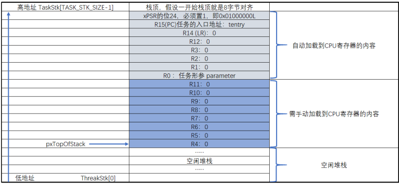

### 任务的定义与任务切换 

裸机系统中两个变量轮流翻转 

```c++
/* flag 必须定义成全局变量才能添加到逻辑分析仪里面观察波形
 * 在逻辑分析仪中要设置以 bit 的模式才能看到波形，不能用默认的模拟量
 */
uint32_t flag1;
uint32_t flag2;


/* 软件延时，不必纠结具体的时间 */
void delay( uint32_t count )
{
    for (; count!=0; count--);
}

int main(void)
{
    /* 无限循环，顺序执行 */
    for (;;) {
        flag1 = 1;
        delay( 100 );
        flag1 = 0;
        delay( 100 );

        flag2 = 1;
        delay( 100 );
        flag2 = 0;
        delay( 100 );
    }
}
```

#### 1、创建任务

##### 1.1、定义任务栈

栈是单片机 RAM 里面一段连续的内存空间，栈的大小一般在启动文件或者链接脚本里面指定， 最后由 C 库函数`_main `进行初始化。 

```c++
#define TASK1_STACK_SIZE 128
StackType_t Task1Stack[TASK1_STACK_SIZE];

#define TASK2_STACK_SIZE 128
StackType_t Task2Stack[TASK2_STACK_SIZE];
```

任务栈其实就是一个预先定义好的全局数据，数据类型为`StackType_t`，大小由 `TASK1_STACK_SIZE` 这个宏来定义， 默认为 128，单位为字，即 512字节，这也是 FreeRTOS 推荐的最小的任务栈。 

**portmacro.h 文件中的数据类型** 

```c++
#ifndef PORTMACRO_H
#define PORTMACRO_H

/* 包含标准库头文件 */
#include "stdint.h"
#include "stddef.h"


/* 数据类型重定义 */
#define portCHAR char
#define portFLOAT float
#define portDOUBLE double
#define portLONG long
#define portSHORT short
#define portSTACK_TYPE uint32_t
#define portBASE_TYPE long

typedef portSTACK_TYPE StackType_t;
typedef long BaseType_t;
typedef unsigned long UBaseType_t;


#endif /* PORTMACRO_H */
```

##### 1.2、定义任务函数

```c++
/* 软件延时 */
void delay (uint32_t count)
{
	for (; count!=0; count--);
}
/* 任务 1 */
void Task1_Entry( void *p_arg ) 
{
    for ( ;; ) {
     flag1 = 1;
     delay( 100 );
     flag1 = 0;
     delay( 100 );
     }
 }

 /* 任务 2 */
 void Task2_Entry( void *p_arg ) 
{
	for ( ;; ) {
        flag2 = 1;
        delay( 100 );
        flag2 = 0;
        delay( 100 );
     }
}
```

##### 1.3、定义任务控制块 

任务控制块类型声明 

```c++
typedef struct tskTaskControlBlock
{
    volatile StackType_t *pxTopOfStack; /* 栈顶 */ 

    ListItem_t xStateListItem; /* 任务节点 */

    StackType_t *pxStack; /* 任务栈起始地址 */
    /* 任务名称，字符串形式 */
    char pcTaskName[ configMAX_TASK_NAME_LEN ];
} tskTCB;

typedef tskTCB TCB_t;
```

- 栈顶指针，作为 TCB 的第一个成员。 
- 任务节点，这是一个内置在 TCB 控制块中的链表节点，通过这个节点，可以将任务控制块挂接到各种链表中。 
- 任务栈起始地址。 
- 任务名称，字符串形式， 长度由宏` configMAX_TASK_NAME_LEN`来控制， 该宏在 `FreeRTOSConfig.h` 中定义，默认为 16。 
- 数据类型重定义。 

**任务控制块定义**

```c++
/* 定义任务控制块 */
TCB_t Task1TCB;
TCB_t Task2TCB;
```

##### 1.4、实现任务创建函数 

任务的栈， 任务的函数实体， 任务的控制块最终需要联系起来才能由系统进行统一调度。那么这个联系的工作就由任务创建函数 xTaskCreateStatic()来实现，该函数在 task.c<font size=2>（task.c 第一次使用需要自行在文件夹 freertos 中新建并添加到工程的 freertos/source 组）</font>中定义， 在 task.h 中声明， 所有跟任务相关的函数都在这个文件定义。

**xTaskCreateStatic()函数** 

```c++
#if( configSUPPORT_STATIC_ALLOCATION == 1 ) 

TaskHandle_t xTaskCreateStatic( TaskFunction_t pxTaskCode,
                               const char * const pcName,
                               const uint32_t ulStackDepth, 
                               void * const pvParameters,
                               StackType_t * const puxStackBuffer,
                               TCB_t * const pxTaskBuffer )
{
    TCB_t *pxNewTCB;
    TaskHandle_t xReturn;

    if ( ( pxTaskBuffer != NULL ) && ( puxStackBuffer != NULL ) ) {
        pxNewTCB = ( TCB_t * ) pxTaskBuffer;
        pxNewTCB->pxStack = ( StackType_t * ) puxStackBuffer;

        /* 创建新的任务 */
        prvInitialiseNewTask( pxTaskCode, /* 任务入口 */
                             pcName, /* 任务名称，字符串形式 */
                             ulStackDepth, /* 任务栈大小，单位为字 */
                             pvParameters, /* 任务形参 */
                             &xReturn, /* 任务句柄 */
                             pxNewTCB); /* 任务栈起始地址 */

    } else {
        xReturn = NULL;
    }

    /* 返回任务句柄，如果任务创建成功，此时 xReturn 应该指向任务控制块 */
    return xReturn; 
}

#endif /* configSUPPORT_STATIC_ALLOCATION */
```

- FreeRTOS 中，任务的创建有两种方法，一种是使用动态创建，一种是使用静态创建。 动态创建时，任务控制块和栈的内存是创建任务时动态分配的， 任务删除时，内存可以释放。 静态创建时，任务控制块和栈的内存需要事先定义好，是静态的内 存 ， 任 务 删 除 时 ， 内 存 不 能 释 放 。  

- 任务入口，即任务的函数名称。` TaskFunction_t` 是在` projdefs.h`（projdefs.h 第一次使用需要在 `include` 文件夹下面新建然后添加到工程 freertos/source 这个组文件）中重定义的一个数据类型，实际就是空指针。

```c++
#ifndef PROJDEFS_H
#define PROJDEFS_H

typedef void (*TaskFunction_t)( void * );

#define pdFALSE ( ( BaseType_t ) 0 )
#define pdTRUE ( ( BaseType_t ) 1 )

#define pdPASS ( pdTRUE )
#define pdFAIL ( pdFALSE )


#endif /* PROJDEFS_H */
```

- 任务名称，字符串形式，方便调试。 
- 任务栈大小，单位为字。 
- 任务形参。 
- 任务栈起始地址。 
- 任务控制块指针。 
- 定义一个任务句柄 xReturn， 任务句柄用于指向任务的 TCB。 任务句柄的数据类型为 TaskHandle_t。
- 调用 prvInitialiseNewTask()函数，创建新任务，该函数在 task.c 实现。

**TaskHandle_t 定义** 

```c++
/* 任务句柄 */
typedef void * TaskHandle_t;
```

**prvInitialiseNewTask()函数** 

```c++
static void prvInitialiseNewTask( TaskFunction_t pxTaskCode,
                                 const char * const pcName, 
                                 const uint32_t ulStackDepth, 
                                 void * const pvParameters,
                                 TaskHandle_t * const pxCreatedTask,
                                 TCB_t *pxNewTCB )

{
    StackType_t *pxTopOfStack;
    UBaseType_t x;

    /* 获取栈顶地址 */
    pxTopOfStack = pxNewTCB->pxStack + ( ulStackDepth - ( uint32_t ) 1 );
    /* 向下做 8 字节对齐 */ 
    pxTopOfStack = ( StackType_t * ) ( ( ( uint32_t ) pxTopOfStack ) & ( ~( ( uint32_t ) 0x0007 ) ) );

    /* 将任务的名字存储在 TCB 中 */ 
    for ( x = ( UBaseType_t ) 0; x < ( UBaseType_t ) configMAX_TASK_NAME_LEN; x++ )
    {
        pxNewTCB->pcTaskName[ x ] = pcName[ x ];

        if ( pcName[ x ] == 0x00 )
        {
            break;
        }
    }
    /* 任务名字的长度不能超过 configMAX_TASK_NAME_LEN */
    pxNewTCB->pcTaskName[ configMAX_TASK_NAME_LEN - 1 ] = '\0';

    /* 初始化任务栈 */
    pxNewTCB->pxTopOfStack = pxPortInitialiseStack( pxTopOfStack, pxTaskCode, pvParameters );


    /* 让任务句柄指向任务控制块 */ 
    if ( ( void * ) pxCreatedTask != NULL )
    {
        *pxCreatedTask = ( TaskHandle_t ) pxNewTCB;
    }
}

static void prvInitialiseNewTask(TaskFunction_t pxTaskCode,
                                 const char * const pcName, 
                                 const uint32_t ulStackDepth,
                                 void * const pvParameters, 
                                 TaskHandle_t * const pxCreatedTask, 
                                 TCB_t *pxNewTCB ) 

{
    StackType_t *pxTopOfStack;
    UBaseType_t x;

    /* 获取栈顶地址 */
    pxTopOfStack = pxNewTCB->pxStack + ( ulStackDepth - ( uint32_t ) 1 );
    /* 向下做 8 字节对齐 */ 
    pxTopOfStack = ( StackType_t * ) \
        ( ( ( uint32_t ) pxTopOfStack ) & ( ~( ( uint32_t ) 0x0007 ) ) );

    /* 将任务的名字存储在 TCB 中 */ 
    for ( x = ( UBaseType_t ) 0; x < ( UBaseType_t ) configMAX_TASK_NAME_LEN; x++ )
    {
        pxNewTCB->pcTaskName[ x ] = pcName[ x ];

        if ( pcName[ x ] == 0x00 )
        {
            break;
        }
    }
    /* 任务名字的长度不能超过 configMAX_TASK_NAME_LEN */
    pxNewTCB->pcTaskName[ configMAX_TASK_NAME_LEN - 1 ] = '\0';

    /* 初始化 TCB 中的 xStateListItem 节点 */ 
    vListInitialiseItem( &( pxNewTCB->xStateListItem ) );
    /* 设置 xStateListItem 节点的拥有者 */
    listSET_LIST_ITEM_OWNER( &( pxNewTCB->xStateListItem ), pxNewTCB );


    /* 初始化任务栈 */ 
    pxNewTCB->pxTopOfStack = pxPortInitialiseStack( pxTopOfStack,
                                                   pxTaskCode,
                                                   pvParameters );


    /* 让任务句柄指向任务控制块 */ 
    if ( ( void * ) pxCreatedTask != NULL )
    {
        *pxCreatedTask = ( TaskHandle_t ) pxNewTCB;
    }
}
```

- 任务入口。 
- 任务名称，字符串形式。 
- 任务栈大小，单位为字。 
- 任务形参。 
- 任务句柄。 
- 任务控制块指针。 
- 获取栈顶地址 。
- 将栈顶指针向下做 8 字节对齐。 在 Cortex-M3（ Cortex-M4 或Cortex-M7）内核的单片机中，因为总线宽度是 32 位的，通常只要栈保持 4 字节对齐就行，可这样为啥要 8 字节？难道有哪些操作是 64 位的？确实有，那就是浮点运算，所以要 8 字节对齐（但是目前我们都还没有涉及到浮点运算，只是为了后续兼容浮点运行的考虑）。
  如果栈顶指针是 8 字节对齐的，在进行向下 8 字节对齐的时候，指针不会移动，如果不是 8 字节对齐的，在做向下 8 字节对齐的时候，就会空出几个字节，不会使用。

- 将任务的名字存储在 TCB 中。 
- 任务名字的长度不能超过` configMAX_TASK_NAME_LEN`， 并以'\0'结尾。 
- 初始化 TCB 中的 `xStateListItem` 节点， 即初始化该节点所在的链表为空，表示节点还没有插入任何链表。 
- 设置` xStateListItem` 节点的拥有者， 即拥有这个节点本身的 TCB。 
- 调用 `pxPortInitialiseStack()`函数初始化任务栈， 并更新栈顶指针，任务第一次运行的环境参数就存在任务栈中。该函数在 port.c（ port.c 第一次使用需要在`freertos\portable\RVDS\ARM_CM3`（ ARM_CM4 或 ARM_CM7） 文件夹下面新建然后添加到工程` freertos/source` 这个组文件）中定义。

**pxPortInitialiseStack()函数** 

```c++
#define portINITIAL_XPSR ( 0x01000000 )
#define portSTART_ADDRESS_MASK ( ( StackType_t ) 0xfffffffeUL )

static void prvTaskExitError( void )
{
    /* 函数停止在这里 */
    for (;;);
}

StackType_t *pxPortInitialiseStack( StackType_t *pxTopOfStack,
                                   TaskFunction_t pxCode,
                                   void *pvParameters )
{
    /* 异常发生时，自动加载到 CPU 寄存器的内容 */
    pxTopOfStack--;
    *pxTopOfStack = portINITIAL_XPSR;
    pxTopOfStack--;
    *pxTopOfStack = ( ( StackType_t ) pxCode ) & portSTART_ADDRESS_MASK;
    pxTopOfStack--;
    *pxTopOfStack = ( StackType_t ) prvTaskExitError; 
    pxTopOfStack -= 5; /* R12, R3, R2 and R1 默认初始化为 0 */
    *pxTopOfStack = ( StackType_t ) pvParameters;

    /* 异常发生时，手动加载到 CPU 寄存器的内容 */
    pxTopOfStack -= 8;

    /* 返回栈顶指针，此时 pxTopOfStack 指向空闲栈 */
    return pxTopOfStack;
}
```



- 异常发生时， CPU 自动从栈中加载到 CPU 寄存器的内容。包括 8个寄存器，分别为 R0、 R1、 R2、 R3、 R12、 R14、 R15 和 xPSR 的位 24，且顺序不能变。 
- xPSR 的 bit24 必须置 1，即 0x01000000。 
- 任务的入口地址。 
- 任务的返回地址，通常任务是不会返回的，如果返回了就跳转到`prvTaskExitError`， 该函数是一个无限循环。 
- R12, R3, R2 and R1 默认初始化为 0。
- 异常发生时，需要手动加载到 CPU 寄存器的内容， 总共有 8 个，分别为 R4、 R5、 R6、 R7、 R8、 R9、 R10 和 R11，默认初始化为 0。  
- 任务第一次
  运行时，就是从这个栈指针开始手动加载 8 个字的内容到 CPU 寄存器： R4、 R5、 R6、 R7、R8、 R9、 R10 和 R11，当退出异常时，栈中剩下的 8 个字的内容会自动加载到 CPU 寄存器：R0、 R1、 R2、 R3、 R12、 R14、 R15 和 xPSR 的位 24。此时 PC 指针就指向了任务入口地址，从而成功跳转到第一个任务。 
- 让任务句柄指向任务控制块。
- 返回任务句柄，如果任务创建成功，此时 xReturn 应该指向任务控制块， xReturn 作为形参传入到 prvInitialiseNewTask 函数。  

#### 2、实现就绪列表

##### 2.1、定义就绪列表 

```c++
/* 任务就绪列表 */
List_t pxReadyTasksLists[ configMAX_PRIORITIES ];
```

- 就绪列表实际上就是一个 List_t 类型的数组，数组的大小由决定最 大 任 务 优 先 级 的 宏 `configMAX_PRIORITIES` 决 定 ， `configMAX_PRIORITIES` 在`FreeRTOSConfig.h `中默认定义为 5，最大支持 256 个优先级。 数组的下标对应了任务的优先级，同一优先级的任务统一插入到就绪列表的同一条链表中。  

##### 2.2、就绪列表初始化 

```c++
void prvInitialiseTaskLists( void )
{
    UBaseType_t uxPriority;

    for ( uxPriority = ( UBaseType_t ) 0U;
         uxPriority < ( UBaseType_t ) configMAX_PRIORITIES;
         uxPriority++ )
    {
        vListInitialise( &( pxReadyTasksLists[ uxPriority ] ) );
    }
}
```

##### 2.3、将任务插入到就绪列表 